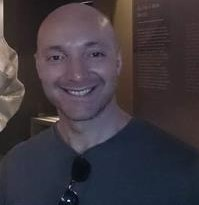

::: {.hero}

  <h1 style="font-size:clamp(2.5rem,6vw,4.6rem); font-weight:700; line-height:1.1; margin:0; padding:0; color:#0b2341;">
    
    Dr. Craig Bower
  </h1>
  <h2 style="margin:0; padding:-1; line-height:1.25; font-weight:750;">
    I research how machine learning, mathematical modelling and uncertainty can be combined to build intelligent systems that learn, predict and make decisions when information is limited, expensive or incomplete.
  </h2>

A recurring question across my work is: <strong>how can an intelligent system learn reliably when observations are sparse, uncertainty matters and acquiring new information is costly?</strong>

:::

## Selected research

::: {.project-grid}
::: {.project-card}
### [HyperFlux](projects/hyperflux/index.qmd)

A self-learning scientific digital twin combining ecosystem physics, graph neural networks, uncertainty-aware prediction and sequential local adaptation.

**Themes:** Scientific ML · Digital twins · GNNs · Online adaptation
:::

::: {.project-card}
### [Variable-Interaction Graph Networks (VIGNet)](projects/vignet/index.qmd)

Learning coupled physical systems from the interactions that actually exist. VIGNet builds neural-operator connectivity directly from PDE variable dependencies, with provable results for approximation, required depth, generalisation and graph mis-specification.

**Themes:** Scientific ML · Coupled PDEs · GNNs
:::

::: {.project-card}
### [ABBDA](projects/abbda/index.qmd)

Efficient monitoring and change detection in massive data streams when observing everything is prohibitively expensive.

**Themes:** Bandits · Sequential decisions · Change detection · Partial information

:::

::: {.project-card}
### Adaptive Scientific Campaigns

A research programme asking how expensive simulations and experiments should be selected to maximise defensible scientific knowledge per unit of cost.

**Themes:** Autonomous science · HPC · Uncertainty · Adaptive experimentation

Portfolio case study in preparation.

:::

::: {.project-card}
### [Physics-Enforced Continuous Neural Operator](projects/pecno/index.qmd)

A continuous neural-field surrogate for AGN jet simulations combining hard physics projection, adaptive conformal uncertainty calibration and controlled generative recovery of smaller spatial scales.

**Themes:** Scientific ML · Neural fields · Uncertainty quantification · Physics enforcement
:::

::: {.project-card}
### Explanatory Computation

**Themes:** Explainable AI · Symbolic Regression 

Portfolio case study in preparation.

:::

::: {.project-card}
### Bandit Neural Architecture Search

**Themes:** Scientific Digital Twins · Multi-armed Bandits · Neural Architecture Search

Portfolio case study in preparation.

:::

::: {.project-card}
### Adversarial Thresholding Semi-Bandits

**Themes:** Non-stochasticity · Thresholding Bandits · ALICE Transition Radiation Detector Control

Portfolio case study in preparation.

:::
:::

## Research direction

My work sits at the intersection of **scientific machine learning**, **sequential decision-making**, **uncertainty quantification** and **autonomous scientific discovery**. The applications vary, but the methodological problem is often the same: we need to make useful predictions or decisions before we have complete information.

## Latest writing

- [HyperFlux: Building a Scientific Digital Twin That Learns](projects/hyperflux/index.qmd)
- [Variable-Interaction Graph Networks: learning the interactions that actually exist](projects/vignet/index.qmd)
- [ABBDA: Learning Where to Look](projects/abbda/index.qmd)
- [PeCNO: Physics-Enforced Continuous Neural Operator](projects/pecno/index.qmd)
