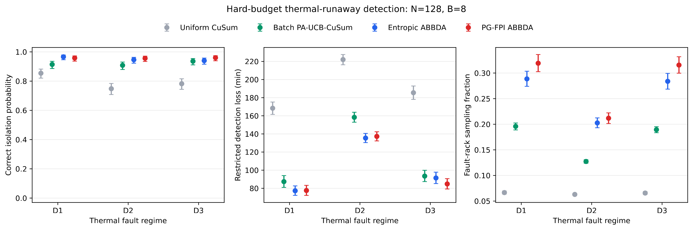
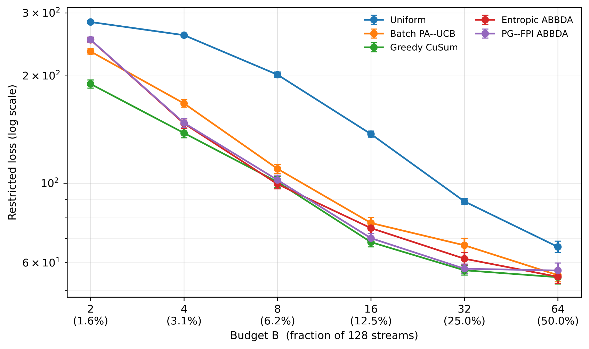
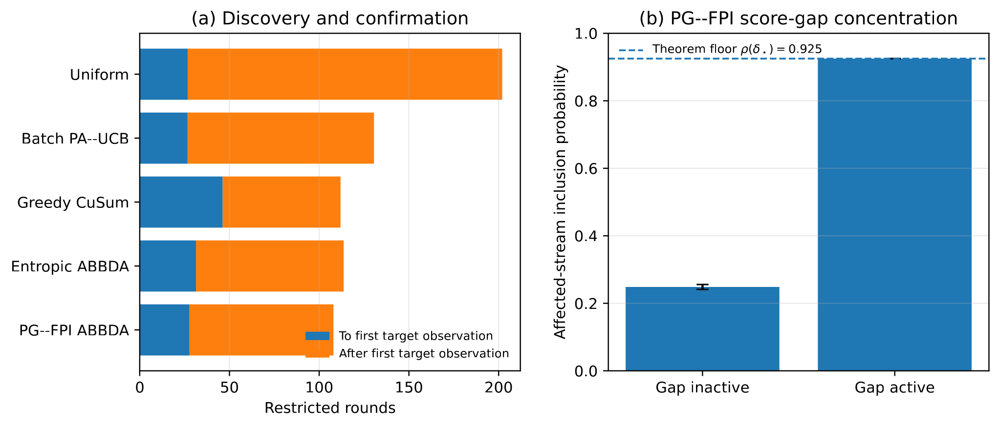
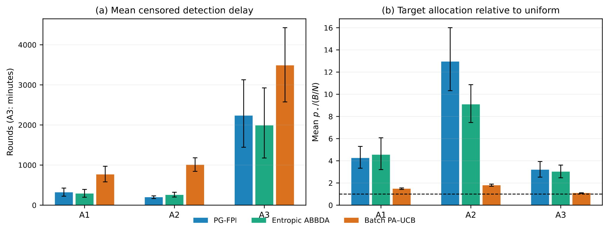
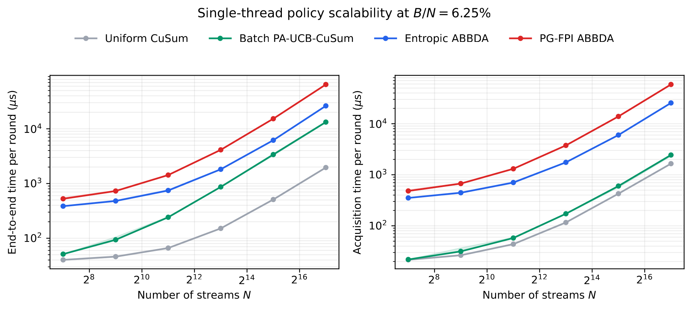
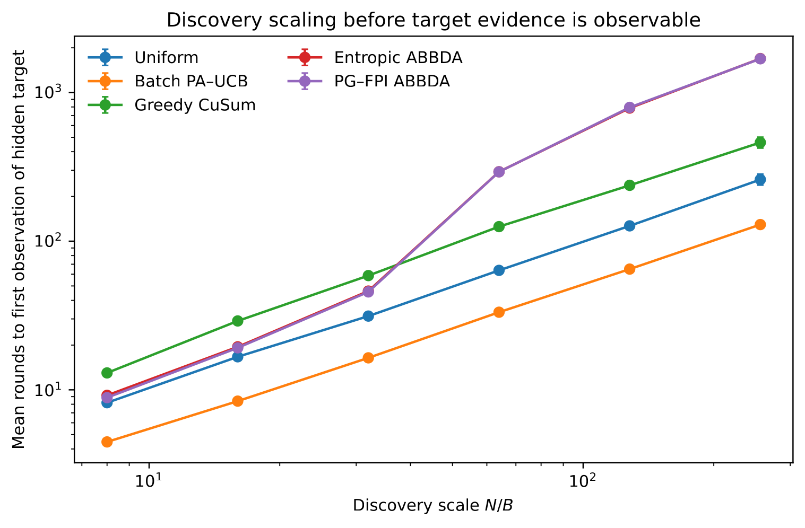

Modern monitoring systems can produce far more data than can be inspected continuously. A data centre may contain thousands of racks, a scientific instrument may expose thousands of channels, and a large network may generate telemetry faster than a monitoring system can process it at full resolution.

This creates a problem that is easy to state but surprisingly difficult to solve:

> **If something is changing somewhere in a large system, where should we look when we can only inspect a small fraction of the available streams at each moment?**

My work on **ABBDA** studies this problem as **quickest change detection under a hard sensing budget**. At every round there are $N$ data streams, but the monitor is allowed to observe exactly $B<N$ of them. The system must decide which $B$ streams to inspect, detect a persistent change quickly, and identify the stream responsible without relaxing the observation budget.

The central idea is that change detection and information acquisition should be treated as two linked decisions. A detector decides **whether enough evidence exists to raise an alarm**. An acquisition policy decides **where to collect the next evidence**.

```{mermaid}
flowchart LR
    A[Exactly B observation slots] --> B[Score all N streams]
    B --> C[Convert scores to soft inclusion probabilities]
    C --> D[Sample an exact B-stream subset]
    D --> E[Observe selected streams]
    E --> F[Update CuSum and acquisition state]
    F --> G{Alarm?}
    G -- No --> A
    G -- Yes --> H[Report change and source]
```

This distinction is important. ABBDA does not obtain its gains by changing the stopping detector for each method. In the manuscript experiments, the policies share the same frozen per-stream CuSum detector. The acquisition rule changes **where the limited measurements are spent**.

## Why this is harder than ordinary change detection

Classical quickest change detection assumes that the observations needed by the detector are available. CuSum, for example, accumulates evidence that a stream has moved from a nominal distribution to a changed distribution [@page1954].

In a very large monitoring problem, however, most streams may be hidden at each round. Before the detector can confirm a change, the system may first have to **discover where the change is occurring**.

That creates a two-stage cost:

1. **search:** spend enough observations across the system to encounter the changed stream;
2. **confirmation:** once evidence begins to accumulate, concentrate enough observations on that stream to cross the alarm boundary.

The sensing budget makes the first cost unavoidable. If only $B$ out of $N$ streams can be observed, there is no policy that can instantly know which unseen stream has changed.

## The common detector: frozen CuSum

For stream $i$, let $S_{t,i}$ denote its CuSum state. When the stream is observed, ABBDA updates that state from its new evidence. When the stream is not observed, the state is frozen:

$$
S_{t,i}=
\begin{cases}
\max\{0,S_{t-1,i}+\ell_i(X_{t,i})\}, & i\in I_t,\\
S_{t-1,i}, & i\notin I_t.
\end{cases}
$$

Here $I_t$ is the subset selected at round $t$, and $\ell_i(X_{t,i})$ is a local log-likelihood or working evidence score.

Freezing matters conceptually. An unobserved stream has provided no new information, so its detector state should neither increase nor decay simply because the monitoring system looked elsewhere.

The alarm rule is then common across policies:

$$
\tau_h=\inf\left\{t\ge 1:\max_i S_{t,i}\ge h\right\}.
$$

The stream with the largest detector state at the stopping time is reported as the source. Because the detector is held fixed, the experiments can ask a cleaner question: **did a better sensing policy use the same observation budget more effectively?**

## The hard budget really is hard

ABBDA requires

$$
|I_t|=B
$$

on every realised round. This is stronger than satisfying the budget only on average.

A vector of inclusion probabilities is therefore not sufficient by itself. Independent Bernoulli draws could select too many or too few streams. Deterministic top-$B$ selection would satisfy the budget, but can permanently lock the monitor onto the wrong streams after early noise.

ABBDA instead builds a vector of marginal inclusion probabilities whose entries sum to $B$, then uses fixed-size probability-proportional-to-size sampling so that **exactly $B$ distinct streams are selected while the intended marginals are preserved**. The implementation uses random-start systematic sampling following Madow's fixed-size construction [@madow1949].

This separates two ideas:

**soft allocation:** how strongly should each stream be prioritised?

**hard execution:** which exact set of $B$ streams should be observed now?

## Entropic ABBDA: persistent evidence plus guaranteed exploration

The first policy, **Entropic ABBDA**, gives each stream an acquisition score based on two kinds of information:

- its current CuSum state, which measures proximity to the alarm boundary;
- a slower evidence state that remembers repeated positive evidence over time.

A simplified view of the acquisition score is

$$
A^{\mathrm{ent}}_{t,i}=E_{t-1,i}+\beta S_{t-1,i},
$$

where $E_{t-1,i}$ is persistent evidence and $S_{t-1,i}$ is the detector state.

These scores are converted to feasible inclusion probabilities through a capped entropy-regularised optimisation. The resulting marginals have the form

$$
q_{t,i}=\min\left\{1,\exp(\eta_A A^{\mathrm{ent}}_{t,i}-\lambda_t)\right\},
\qquad \sum_i q_{t,i}=B.
$$

The cap at one is essential because these are **inclusion probabilities for a multiple-play decision**, not ordinary softmax weights that sum to one.

ABBDA then mixes this adaptive allocation with a uniform exploration component:

$$
p_t=(1-\epsilon)q_t+\epsilon\frac{B}{N}\mathbf 1.
$$

Therefore every stream retains a non-zero chance of being observed:

$$
p_{t,i}\ge \epsilon B/N.
$$

This floor is more than a practical safeguard. It is what prevents permanent starvation and supports an explicit coverage guarantee.

## PG--FPI ABBDA: is the evidence actually progressing?

Entropic ABBDA asks how much evidence has accumulated. **PG--FPI ABBDA** adds another question:

> **Does the recent trajectory of this stream look as though it is making sustained progress towards the alarm boundary?**

Two streams can have the same current CuSum value for very different reasons. One may have built evidence steadily over several observations. Another may have reached the same value because of one unusually large transient spike.

PG--FPI tracks the increments within the current positive CuSum run and builds a finite-time first-passage score: an approximation to the probability that the stream will reach the alarm boundary within a future horizon if its current behaviour persists.

The first-passage component is based on the Brownian crossing approximation

$$
\mathcal Q(\mu,v,d,L)=
\Phi\!\left(\frac{\mu L-d}{\sqrt{vL}}\right)
+\exp\!\left(\frac{2\mu d}{v}\right)
\Phi\!\left(-\frac{\mu L+d}{\sqrt{vL}}\right),
$$

where $d$ is distance to the boundary, $\mu$ is an estimated drift, $v$ a variance rate and $L$ a look-ahead horizon.

PG--FPI uses both a pessimistic and an optimistic version of this score. The pessimistic term activates only after repeated observations support positive drift. The optimistic term preserves sensitivity while the trajectory is still uncertain, but is gated down once stronger persistent evidence develops.

The resulting score augments the Entropic ABBDA score rather than replacing the common detector. This is a key scientific distinction: the first-passage calculation changes **where the monitor looks**, not **what constitutes an alarm**.

## What is actually proved

The theoretical analysis is deliberately separated from the simulation evidence.

First, there is an unavoidable **discovery cost**. Before any informative observation from the affected stream has been seen, a hard $B$-of-$N$ sensing budget imposes a worst-case search cost of order

$$
\Omega(N/B).
$$

This formalises the intuitive fact that a monitor cannot identify an unseen change for free.

Second, both ABBDA variants satisfy the exact resource constraint and retain a geometric coverage mechanism through the exploration floor. No stream can be assigned zero marginal probability indefinitely.

Third, under positive bounded post-change drift assumptions, the shared detector plus ABBDA's coverage floor gives a conservative crossing-delay envelope of the form

$$
O\!\left(\frac{Nh}{\epsilon B\mu}\right),
$$

where $h$ is the alarm threshold and $\mu$ characterises post-change evidence.

The refined theory then separates the cost of **finding and separating the affected stream** from the cost of **collecting enough post-change evidence to confirm it**. When the learned acquisition score develops a sufficiently large gap in favour of the changed stream, the effective observation rate increases and the confirmation phase can shorten accordingly.

The PG--FPI first-passage score can help create that separation, but its plug-in drift bounds are **not** claimed to be time-uniform confidence sequences. Likewise, the paper does not claim full Lorden optimality or universal dominance over all competing sensing rules.

That boundary matters to me. A theoretical mechanism should be described in terms of what has actually been proved, not promoted beyond its assumptions.

## Main experiment: thermal-runaway monitoring in a data centre

The main controlled experiment models $N=128$ data-centre racks arranged across eight cold aisles. The monitor can inspect exactly $B=8$ racks per minute: only **6.25% of the system** at each round.

Three persistent fault regimes are simulated:

- **D1: valve failure** — an abrupt persistent thermal residual shift;
- **D2: heat-exchanger fouling** — a gradual fault whose early evidence is weak;
- **D3: workload interference** — a persistent target fault surrounded by many short-lived non-fault transients.

Every acquisition policy uses the same frozen CuSum detector. Thresholds are calibrated separately under null data because adaptive observation changes the null distribution of detector paths. The locked evaluation then uses 500 paired episodes in each regime so that competing methods see the same latent fault realisation.

{#fig-dc fig-alt="Benchmark comparing Uniform CuSum, Batch PA-UCB, Entropic ABBDA and PG-FPI ABBDA across three thermal fault regimes."}

Across the 1,500 paired episodes, the manuscript reports that Entropic ABBDA reduces restricted loss by **11.68 minutes** relative to Batch PA--UCB, while PG--FPI reduces it by **13.17 minutes**. Correct isolation improves by **3.13** and **3.87 percentage points**, respectively.

The allocation behaviour helps explain those differences. Entropic ABBDA directs 8.75 percentage points more post-change sensing to the faulty rack than Batch PA--UCB; PG--FPI directs 11.13 points more.

The gradual D2 regime is particularly informative because early evidence is weak. D3 is also important because it tests whether the policy can distinguish persistent evidence from transient high-amplitude distractions.

## The budget frontier: when adaptive sensing helps, and when it does not

A useful method should not be judged only at one convenient sensing budget. The manuscript therefore repeats the main experiment for

$$
B\in\{2,4,8,16,32,64\}
$$

at fixed $N=128$.

{#fig-budget fig-alt="Budget frontier showing restricted loss for Batch PA-UCB, Greedy CuSum, Entropic ABBDA and PG-FPI ABBDA over sensing budgets from 2 to 64 streams."}

The result is a genuine regime split rather than a universal ranking.

At the extreme $B=2$ budget, both ABBDA variants perform worse than Batch PA--UCB. At $B=4$ and $B=8$, both ABBDA variants improve on it. PG--FPI also improves at $B=16$, both methods improve at $B=32$, and by $B=64$ the differences become much smaller. A strong Greedy CuSum rule is competitive and often has the lowest finite-simulation loss.

The useful conclusion is therefore narrower and more informative:

> **ABBDA is most useful when sensing is scarce enough that allocation matters, but not so scarce that the learned acquisition score receives too little evidence to become reliable.**

That is exactly the kind of operating boundary I want this work to expose.

## Why does it work? A mechanism audit

End-to-end performance alone does not reveal why an adaptive policy behaves differently. The manuscript therefore instruments the $B=8$ experiments and decomposes the outcome into the time needed to reach the affected stream and the time needed after that first useful observation.

{#fig-mechanism fig-alt="Two-panel mechanism audit showing first-hit versus post-hit time and PG-FPI target inclusion probability under inactive and active score-gap conditions."}

This exposes an important trade-off. Greedy CuSum can concentrate very strongly once it locks onto a promising stream, but can take longer to reach the correct target. PG--FPI reaches the target sooner in the audited setting while still concentrating its later observations. Its correct-isolation point estimate is also the strongest among the causal policies in the mechanism table.

The audit additionally checks whether the affected-stream inclusion probability changes when the score-separation condition appearing in the theory is active. This connects the mathematical mechanism to an observable property of the implemented policy rather than treating the theorem and the experiment as unrelated parts of the paper.

## Cross-domain stress tests

The next question is whether the same acquisition principle survives outside the 128-rack simulator.

The manuscript tests three larger controlled settings:

- **A1:** 1,000 streams, 25 observations per round, one persistent mean shift;
- **A2:** 1,000 heavy-tailed streams with transient decoys and one persistent target;
- **A3:** a 2,160-stream emulator motivated by the ALICE Transition Radiation Detector at CERN.

{#fig-crossdomain fig-alt="Cross-domain results for A1, A2 and A3 comparing PG-FPI, Entropic ABBDA and Batch PA-UCB in detection delay and target-stream allocation."}

A1 is a clean discovery problem. A2 is more closely aligned with PG--FPI's design because isolated high-amplitude events should not be enough to trigger sustained commitment. A3 tests a gradual structured fault in a much larger monitoring problem.

For the ALICE-inspired experiment, the model uses 540 nominal chamber positions and four **synthetic** control summaries per position, giving $N=2160$ streams. The injected fault is a gradual gain drift in an anode-current summary. The experiment is a deterministic emulator calibrated to publicly documented detector behaviour; it does **not** use measured CERN DCS traces.

Across A1--A3, the manuscript reports that every paired PG--FPI-minus-Batch-PA--UCB delay interval excludes zero. PG--FPI does not, however, consistently improve on Entropic ABBDA. In the ALICE emulator, Entropic ABBDA has the better delay point estimate and one additional correct isolation, while the two ABBDA variants are not cleanly separated statistically.

Again, the point is not to manufacture universal dominance. The evidence supports adaptive allocation as a useful mechanism across several controlled settings, while also showing that the extra PG--FPI machinery is most valuable in particular regimes rather than everywhere.

## Computational scalability

An adaptive sensing rule is only useful in practice if its decision loop remains tractable as the number of streams grows. The manuscript therefore includes a single-thread scaling benchmark at a fixed sensing fraction of $B/N=6.25\%$.

{#fig-scalability fig-alt="Two log-scale line plots showing end-to-end time per round and acquisition time per round versus number of streams for Uniform CuSum, Batch PA-UCB, Entropic ABBDA and PG-FPI ABBDA."}

The figure shows a clear computational ordering. **Uniform CuSum** is cheapest because it applies the shared detector with minimal acquisition logic. **Batch PA--UCB** adds policy overhead but remains relatively light. **Entropic ABBDA** is more expensive because it scores every stream, enforces feasible marginals and performs exact-budget fixed-size sampling. **PG--FPI ABBDA** is the most computationally demanding because it augments that loop with first-passage calculations.

That does not undermine the scientific result; it simply makes the trade-off explicit. ABBDA is buying better use of scarce observations at the cost of heavier acquisition logic. The important operational point is that the complete loop and the acquisition step both scale smoothly over several orders of magnitude rather than showing an abrupt failure mode as $N$ grows.

## The hidden-stream scaling question

The theory predicts that before the affected stream has produced any observable evidence, discovery should inherit an $N/B$ dependence from the sensing budget.

The manuscript includes an explicit hidden-source discovery audit to examine that scaling experimentally.

{#fig-discovery fig-alt="Log-log hidden-source discovery audit comparing first observation time with the N over B scale."}

I consider this diagnostic useful because it tests a structural limitation of the problem itself, not just the performance of a particular implementation. When only a fixed fraction of a very large system can be inspected, there is an irreducible cost to finding a previously hidden source of change.

## What ABBDA is — and what it is not

The current work grew out of my PhD research on **Adversarial Thresholding Semi-Bandits** [@bower2020]. The name ABBDA reflects that lineage: adaptive allocation of a limited observation budget under partial feedback.

The objective in this manuscript is different. The earlier work studied threshold-deviation decisions in a semi-bandit setting. The present problem is **distributional quickest change detection**. Its outputs are alarm time, source isolation, false-alarm behaviour and sensing allocation rather than a transfer of the earlier regret objective.

It is also important not to confuse several different claims:

**Exact-budget guarantee:** every realised round uses exactly $B$ observation slots.

**Coverage guarantee:** the exploration floor prevents a stream from being assigned zero observation probability indefinitely.

**Conditional detection bounds:** finite-time delay bounds require explicit statistical assumptions about post-change evidence and, for the stronger additive results, additional conditions.

**Empirical calibration:** false-alarm operating points in the correlated simulators are established through separate null simulation rather than asserted from a misspecified parametric model.

**Simulation evidence:** the data-centre and ALICE studies establish performance on controlled simulators and emulators. They are not production deployment results.

## Why this matters beyond change detection

The broader problem is not specific to temperature sensors or particle detectors. It appears whenever **information itself is a scarce resource**.

A cyber-defence system may not be able to inspect every host at full fidelity. An industrial plant may have thousands of telemetry signals but limited diagnostic bandwidth. A scientific experiment may expose more channels than can be read or processed continuously. A distributed system may need to decide which nodes deserve expensive measurements. A future autonomous laboratory may have to decide not only what it believes, but **which observation is worth paying for next**.

That connects ABBDA to a recurring theme across my research:

> **How should an intelligent system allocate attention when it cannot observe everything, uncertainty matters, and the act of acquiring information has a real cost?**

ABBDA treats monitoring as an active decision problem. The aim is not merely to detect change after the relevant data happen to arrive, but to learn **where to look** so that a constrained monitoring system spends its scarce observations where they are most informative while never losing sight of the rest of the system.

## References

::: {#refs}
:::
