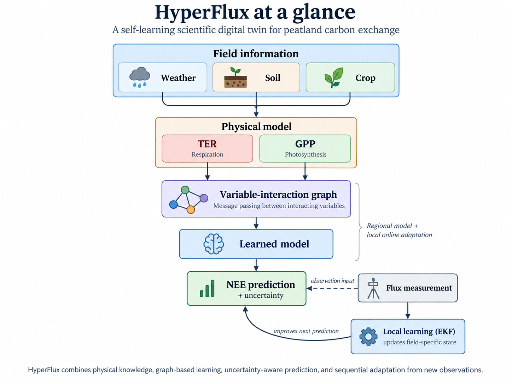
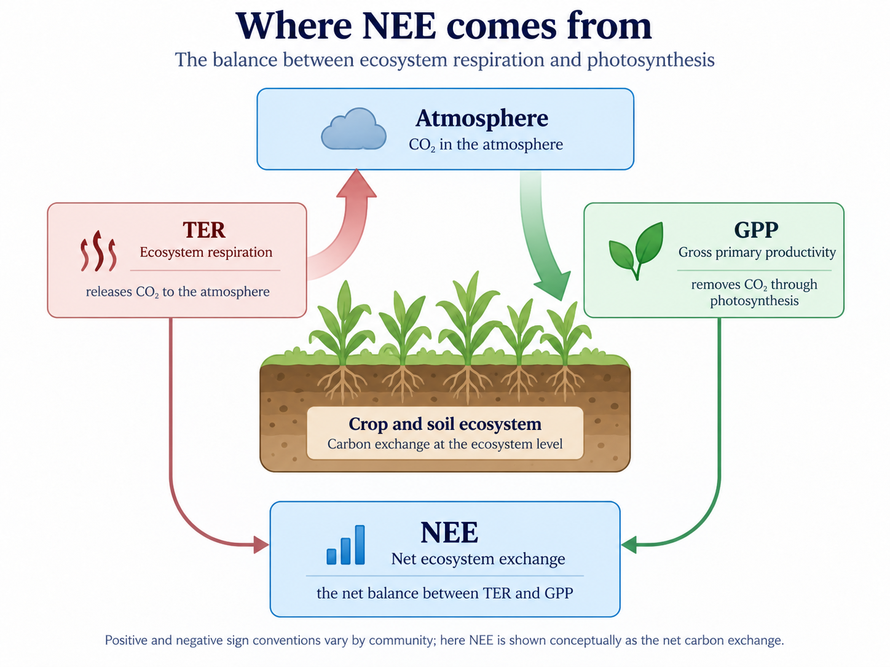
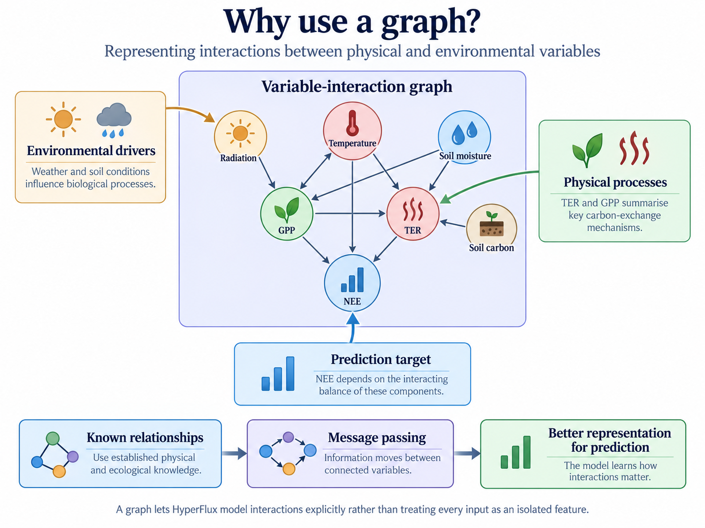
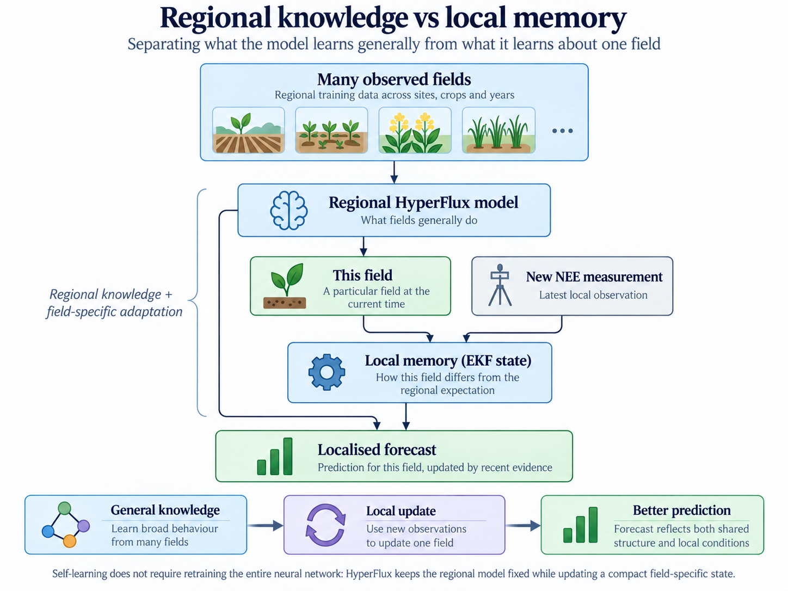
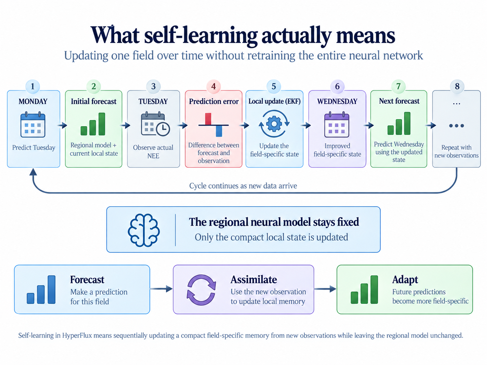
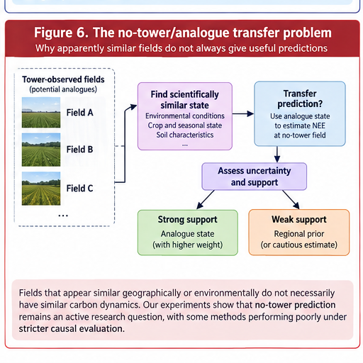

Agricultural peatlands present a difficult scientific and modelling problem. They can act as both sources and sinks of carbon dioxide, and that balance changes continually with temperature, sunlight, soil moisture, crop growth, season and land management.

One of the most useful measurements is **net ecosystem exchange (NEE)**: the net movement of carbon dioxide between an ecosystem and the atmosphere. Flux towers can measure this directly, but they are expensive and sparse.

That creates a recurring problem in scientific machine learning:

> **How can we make useful predictions about a complex physical system when observations are limited, the underlying physics is only partly known, and the system itself changes through time?**

My work on **HyperFlux** has focused on that problem. HyperFlux is being developed as a scientific digital twin for intensively managed lowland peat agriculture. Rather than producing one prediction and then remaining permanently fixed, the aim is to combine physical knowledge, machine learning and new observations so that the twin can adapt as conditions change.

{#fig-overview fig-alt="HyperFlux architecture showing field information, TER and GPP physical processes, graph message passing, learned NEE prediction, uncertainty and EKF local learning."}

## Why an ordinary machine-learning model is not enough

A conventional machine-learning model could take variables such as temperature, radiation and soil moisture and learn a mapping directly to carbon exchange. That can work when future conditions resemble the data on which the model was trained.

Scientific use creates harder requirements. We may want to understand *why* a prediction changed, ask what could happen under different conditions, forecast several days ahead, reason about physical processes that are not directly measured, or decide when a prediction should not be trusted.

HyperFlux therefore combines a learned model with simplified representations of the physical processes that generate carbon exchange. This follows the broader physics-informed machine-learning principle of combining data with mechanistic or mathematical knowledge rather than treating them as competing alternatives [@karniadakis2021physics].

## Starting with the carbon balance

HyperFlux reasons explicitly about two important components of ecosystem carbon exchange.

**Total ecosystem respiration (TER)** represents carbon dioxide released through biological respiration. Temperature-response formulations, including Q10-style models, are well established in ecosystem and soil-respiration modelling [@lloyd1994temperature].

**Gross primary productivity (GPP)** represents carbon uptake through photosynthesis. Light-response approaches are widely used to partition measured net ecosystem exchange into photosynthetic assimilation and ecosystem respiration while accounting for environmental effects [@lasslop2010separation].

{#fig-nee fig-alt="Diagram showing TER releasing carbon dioxide to the atmosphere, GPP removing carbon dioxide through photosynthesis, and NEE as the net balance."}

The physics component is not intended to be a perfect mechanistic description of every ecological process. Its role is to provide the learning system with meaningful structure. The learned component can then represent residual behaviour that the simplified equations do not capture.

In other words:

> **Physics provides structure; machine learning provides flexibility.**

## Learning physical behaviour from observations

Many quantities we care about cannot simply be read from a sensor. Parameters describing respiration sensitivity, photosynthetic capacity or environmental response may be **latent**. We have to infer them from behaviour that we can observe.

This is an **inverse problem**: instead of starting with known physical parameters and calculating the resulting carbon exchange, we observe carbon exchange and ask which physical states or parameter values could plausibly have produced it.

There is an important limitation. Multiple parameter combinations can sometimes explain almost the same observed behaviour. This is an **identifiability problem**.

A model-generated parameter value is therefore not automatically a measurement, and it may not be uniquely determined by the data. Scientific interpretability requires us to say what the observations genuinely constrain rather than presenting every inferred quantity as equally well established.

## Why represent the system as a graph?

Environmental systems consist of interacting processes. Temperature affects respiration. Radiation influences photosynthesis. Soil moisture can constrain biological activity. Crop state, soil carbon and weather interact rather than acting as unrelated features.

HyperFlux therefore represents important environmental and physical variables as nodes in a **variable-interaction graph**.

{#fig-graph fig-alt="Variable interaction graph connecting temperature, radiation, soil moisture, soil carbon, crop state, GPP, TER and NEE."}

A graph neural network lets information move between connected quantities through **message passing**. The general message-passing neural-network framework formalises this idea as learned exchange and aggregation of information over graph edges [@gilmer2017neural].

The purpose is not to make the model more complicated for its own sake. It is to encode the idea that the system consists of interacting processes and to let the learned representation exploit those interactions.

## Regional knowledge and local memory

One of the central ideas behind HyperFlux is to separate two kinds of knowledge.

The **regional model** learns patterns that recur across multiple observed fields, crops and seasons: what fields broadly tend to do.

A particular field can nevertheless behave differently from that regional expectation. HyperFlux therefore maintains a smaller **local state** that captures how the current field differs.

{#fig-regional-local fig-alt="Many observed fields train a regional model. A local field and new NEE measurement update an EKF local memory, producing a field-specific forecast."}

When a new flux-tower observation becomes available, that local state can be updated sequentially using an **Extended Kalman Filter (EKF)**. The EKF is a classical state-estimation method for nonlinear systems that updates a current state estimate and its uncertainty using new observations [@welchbishopkalman].

Conceptually, the cycle is:

**regional prediction → new observation → prediction error → local-state update → revised prediction**

This gives the digital twin a form of memory without requiring the entire neural network to be retrained whenever a new measurement arrives.

## What self-learning means here

The phrase *self-learning* can easily become vague. In HyperFlux it has a specific operational meaning.

{#fig-self-learning fig-alt="Timeline showing Monday prediction, Tuesday observation and prediction error, EKF local update, and improved Wednesday forecast."}

The regional neural model can remain fixed while a compact field-specific state is updated as new evidence arrives. This distinction matters because online learning does not necessarily require continuous neural-network retraining.

For scientific forecasting, evaluation must also be causal. Information from tomorrow cannot be allowed to improve today's forecast. HyperFlux therefore uses walk-forward reasoning in which each prediction is based only on information that would genuinely have been available at that point in time.

## Quantifying uncertainty

A scientific prediction should not be presented as perfectly certain.

HyperFlux therefore exposes uncertainty alongside its predictions. One component uses Monte-Carlo dropout: dropout is retained during repeated inference so that variation across stochastic forward passes can be used as an approximate representation of model uncertainty, following the Bayesian interpretation developed by Gal and Ghahramani [@gal2016dropout].

Other uncertainty arises from local state estimation and, in transfer settings, from how strongly another field supports the target field.

These distinctions matter because the useful question is not only **"How uncertain is this prediction?"** but also **"Why is it uncertain?"**

## Counterfactual questions

A digital twin containing both learned behaviour and physical structure can be used to ask questions of the form:

**What might happen if conditions were different?**

For example, we can alter an environmental driver and propagate the changed state through the same modelling pipeline. These experiments can help explore sensitivity to temperature, radiation, soil moisture or alternative future conditions.

A counterfactual prediction is not automatically a causal conclusion. Its credibility still depends on whether the intervention is scientifically meaningful and whether the model adequately represents the mechanisms affected by the change.

## Looking into future conditions

The same modelling framework can be driven by future meteorological inputs. Shorter-term forecasts can use weather forecasts; longer-term scenario analysis can use climate projections.

This asks a fundamentally different question from ordinary interpolation:

> **What might this system do under environmental conditions that have not yet occurred?**

That is precisely where uncertainty and validation become especially important because the model may be moving further away from the conditions represented by its original observations.

## The harder problem: fields without flux towers

A field without a flux tower cannot genuinely self-learn from local NEE observations because those observations do not exist. This turns the problem from **adaptation** into **transfer**.

We have investigated whether information learned at instrumented fields can be transferred to a scientifically similar uninstrumented field.

{#fig-no-tower fig-alt="Tower-observed fields feed an analogue selection process. Transfer to an untowered field is moderated by uncertainty and support, with strong support using analogue state and weak support reverting toward regional prior."}

The obvious idea is to identify a similar field and copy its behaviour. More rigorous experiments showed why that is too simple. Fields that appear similar geographically or environmentally do not necessarily have sufficiently similar carbon dynamics. Seasonal state matters as well: a midsummer crop should not automatically be matched to a donor represented by an end-of-season state.

The no-tower problem therefore remains an **active research question**, not a capability I currently present as solved.

## What happens when the model is wrong?

For me, this is one of the most important questions in scientific AI.

When a prediction is poor, reporting a larger error is only the start. We want to ask what may have caused it:

- Was the regional model inappropriate for this field?
- Did the local state fail to adapt quickly enough?
- Was a physical parameter weakly identified?
- Was the field operating outside conditions represented in training?
- Was uncertainty already signalling that the prediction should not be trusted?
- Did an apparently similar field turn out not to be a useful analogue?

These questions move the task from prediction toward **scientific diagnosis**.

## What HyperFlux has taught me

Several lessons extend well beyond peatland carbon modelling.

First, adding physics to machine learning does not automatically make the resulting model physically correct.

Second, an inferred physical parameter is not the same thing as a directly measured quantity.

Third, uncertainty should influence how strongly transferred information is trusted.

Fourth, online learning does not always require neural-network retraining.

Fifth, negative results are scientifically useful. A transfer method that fails under rigorous evaluation tells us something important about what the available information does not justify.

Finally, scientific AI becomes more useful when a prediction comes with **provenance**: what information produced it, what assumptions were involved, what remains uncertain, and how the prediction changed when new evidence arrived.

## Why this matters beyond peatlands

The underlying problem occurs throughout science and industry.

An industrial process may have only a small number of sensors. A machine may behave differently from the population on which a model was trained. A digital twin may need to adapt as equipment ages. A scientific instrument may generate observations too slowly or expensively to retrain a large model continually. A model may need to combine mechanistic equations with data rather than choosing between physics and machine learning.

The broader question is therefore:

> **How do we build intelligent systems for complex physical processes when observations are sparse, physics is incomplete, conditions change and uncertainty matters?**

HyperFlux is one setting in which I have been investigating that question.

## References

::: {#refs}
:::
