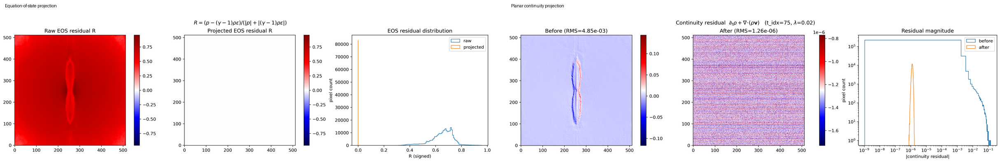
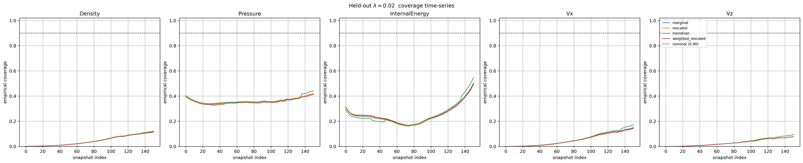
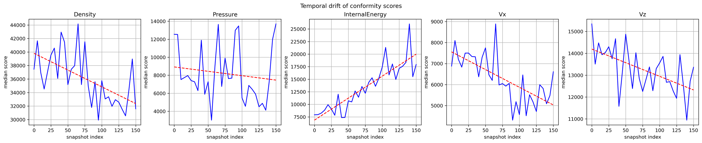
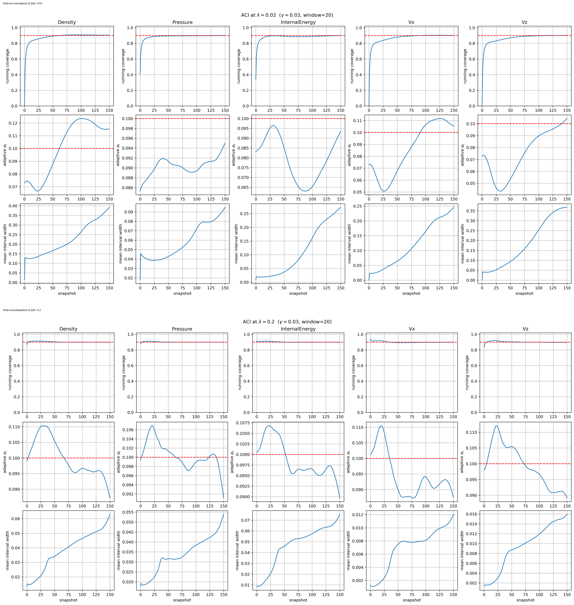
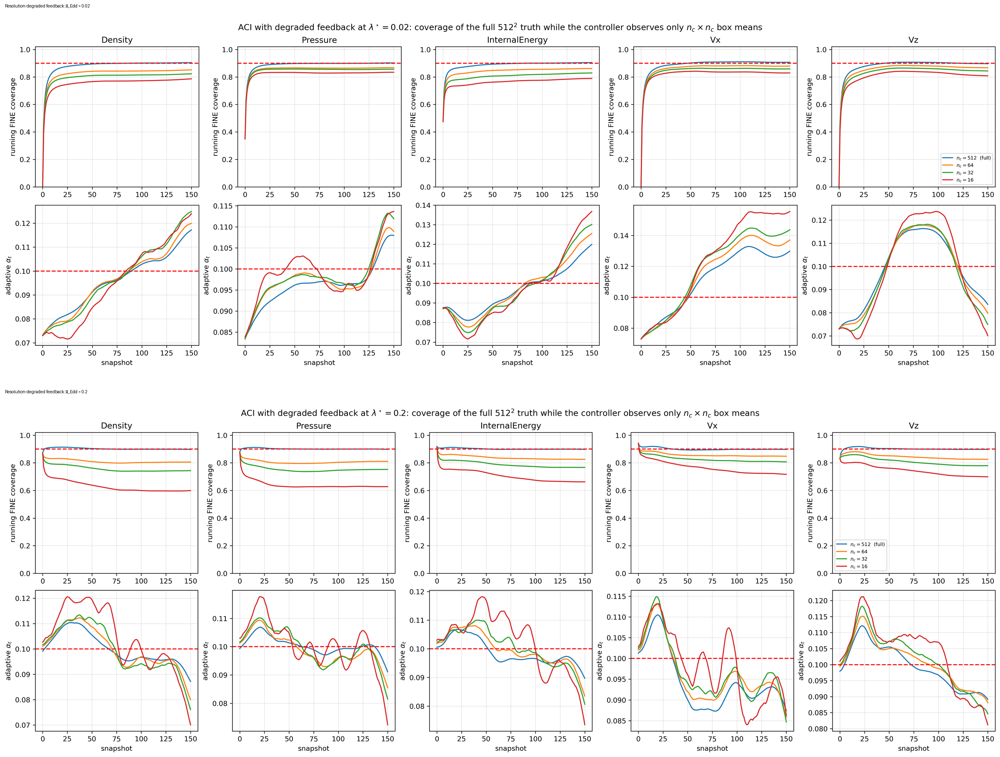
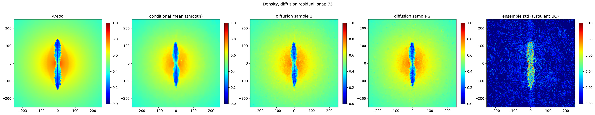
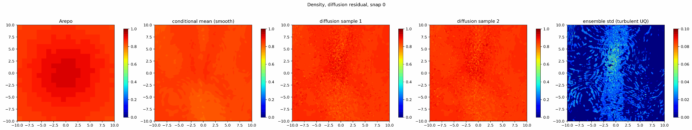
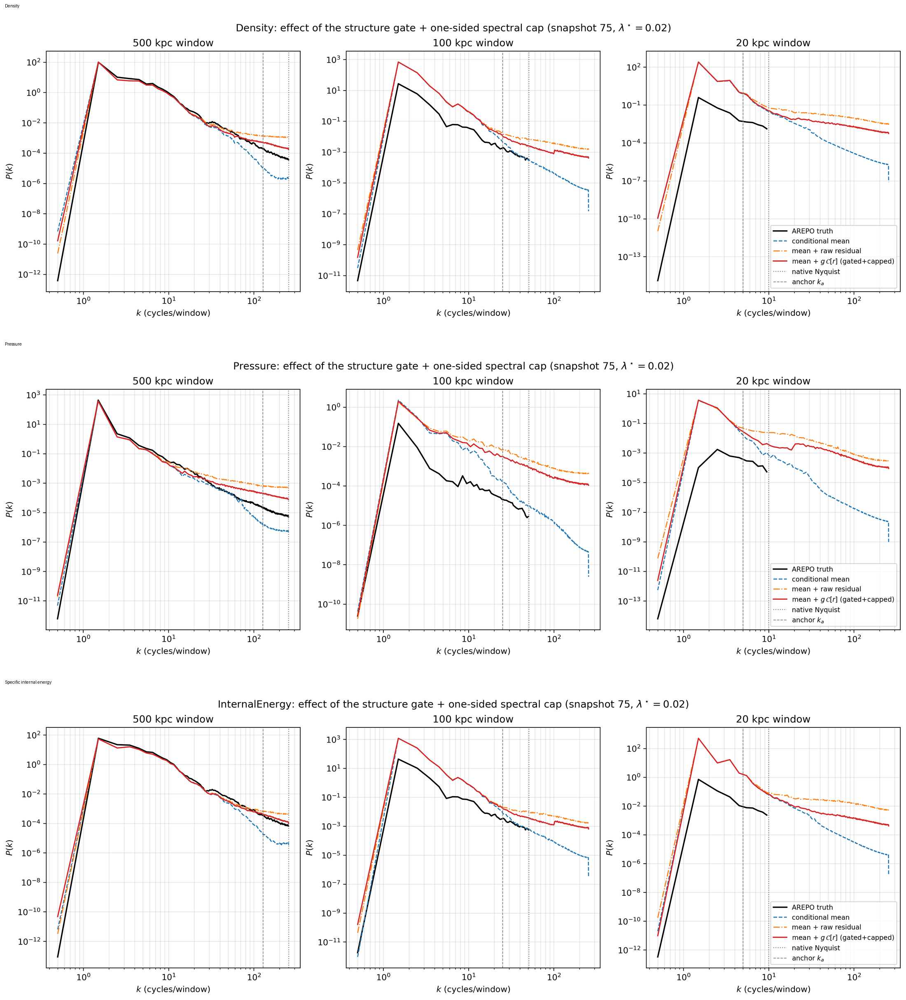

High-resolution simulations of active galactic nucleus (AGN) jets are scientifically valuable and computationally expensive. The moving-mesh calculations used in this work can require of order $10^5$ CPU-hours for a single high-resolution feedback calculation [@BourneSijacki2017]. The _Eddington_ _ratio_ compares how fast a supermassive black hole is actually swallowing surrounding matter with its theoretical limit. That makes dense exploration of physical parameters such as the Eddington ratio impractical.

A learned surrogate offers a possible alternative: run a limited number of expensive simulations, learn their common structure, and then query the surrogate at physical conditions that have not themselves been simulated.

But that immediately creates a harder question than ordinary prediction:

> **If a scientific surrogate is asked to predict a new physical regime, how do we know whether its uncertainty estimate is still trustworthy?**

My work on **PeCNO**, a physics-enforced continuous neural-field/operator surrogate, studies this question using idealised AGN jet--intracluster-medium simulations. The system combines a continuous coordinate-based predictor, explicit post-prediction physics projection, non-crossing uncertainty heads, conformal calibration, adaptive conformal inference and a controlled generative residual for smaller spatial scales.

The most important result is not simply that the surrogate can produce plausible fields. It is that **uncertainty calibration that works on the simulations used for calibration can fail badly at an unseen physical parameter value — and online feedback can repair that failure in a precisely defined sense.**

{#fig-architecture fig-alt="Architecture of the PeCNO AGN-jet surrogate showing simulation slices, a Fourier-feature SIREN with FiLM conditioning, prediction and uncertainty heads, physical projection, adaptive conformal calibration and a gated generative residual."}

## The scientific problem

The simulations follow AGN jets interacting with the surrounding intracluster medium, a setting in which jets inflate cavities, drive shocks and turbulence and redistribute energy through the surrounding gas [@BourneYang2022].

The study uses six idealised **AREPO** simulation sequences. Each sequence contains 151 snapshots separated by 0.5 Myr. For machine-learning purposes each snapshot is represented as a $512\times512$ planar $(x,z)$ slice covering a 500 kpc domain.

At every spatial location the surrogate predicts five fields:

$$
\mathbf u=(\rho,p,\varepsilon,v_x,v_z),
$$

where $\rho$ is density, $p$ is pressure, $\varepsilon$ is specific internal energy and $v_x,v_z$ are the two in-plane velocity components.

Four Eddington ratios are used for training:

$$
\lambda_{\mathrm{Edd}}\in\{0.001,0.002,0.01,0.1\}.
$$

Two simulations are hidden completely from training. The held-out value $\lambda_{\mathrm{Edd}}=0.02$ lies inside the training range and therefore tests **interpolation**. The held-out value $\lambda_{\mathrm{Edd}}=0.2$ lies outside the training range and tests **extrapolation**.

That distinction is important because a surrogate is useful precisely when we want to query a physical condition for which the expensive reference simulation has not already been run.

## A continuous field rather than a fixed image generator

The central object learned by PeCNO is a continuous map

$$
(x,z,t,\lambda_{\mathrm{Edd}})
\longmapsto
(\hat\rho,\hat p,\hat\varepsilon,\hat v_x,\hat v_z).
$$

Rather than predicting only one fixed $512\times512$ image, the model represents the physical fields as functions of spatial coordinates, evolutionary time and Eddington ratio.

Spatial position answers **where** the field is being queried. Time and Eddington ratio answer **which physical state** is required.

To represent several spatial scales, the model first maps coordinates through Gaussian random Fourier features [@rahimi2007]. These make a range of spatial frequencies readily available to the network. A SIREN trunk then represents the continuous field using sinusoidal neural layers [@Sitzmann2020].

Time and $\log_{10}\lambda_{\mathrm{Edd}}$ condition the spatial representation through feature-wise linear modulation, or **FiLM** [@Perez2018]. In plain terms, the spatial trunk learns a reusable set of spatial structures while the conditioning network learns how strongly those structures should appear at a particular time and Eddington ratio.

The base operator used for the manuscript's fidelity and uncertainty experiments contains 147,087 trainable parameters.

## Predicting uncertainty as well as the field

A scientific surrogate should not return only a point estimate. PeCNO therefore predicts non-crossing lower, central and upper quantile fields for every hydrodynamic channel.

Those raw neural intervals are useful, but they are not automatically calibrated. If an interval is described as a nominal 90% interval, we would like approximately 90% of future observations to fall inside it under the conditions covered by the statistical guarantee.

**Conformal prediction** provides a way to calibrate such intervals using previous prediction errors [@Vovk2005; @Romano2019]. Standard split conformal prediction is attractive because its finite-sample marginal coverage result makes very weak assumptions about the underlying predictor.

It does, however, require a crucial condition: the calibration and test errors must be **exchangeable** — roughly, statistically interchangeable.

For a parameterised scientific surrogate this is exactly the assumption that may fail. An error made at $\lambda_{\mathrm{Edd}}=0.001$ need not have the same distribution as an error made at $\lambda_{\mathrm{Edd}}=0.2$. The same issue can arise through time as a jet evolves from an early state into a later, dynamically different state.

## Physics is enforced after the neural prediction

PeCNO does not rely only on soft physics penalties during training. The network first proposes a state, and selected physical relations are then imposed by deterministic **a posteriori projection**.

The correction sequence is

$$
\mathsf C_1\rightarrow\mathsf C_2\rightarrow\mathsf C_3,
$$

corresponding to positivity of the thermodynamic variables, consistency with the ideal-gas equation of state, and consistency with a planar continuity equation.

This distinction matters: a training penalty can encourage a relation, whereas a projection can enforce the chosen constraint to numerical precision.

{#fig-physics fig-alt="Combined equation-of-state and planar-continuity diagnostics showing very large residual reductions after deterministic projection."}

The physics results are substantial. At $\lambda_{\mathrm{Edd}}=0.02$, the Helmholtz--Hodge projection reduces the RMS planar-continuity residual from $5.13\times10^{-3}$ to $1.33\times10^{-6}$, a factor of about $3.9\times10^3$. At $\lambda_{\mathrm{Edd}}=0.2$ the reduction is from $6.13\times10^{-3}$ to $4.86\times10^{-7}$, a factor of about $1.3\times10^4$.

The equation-of-state calculation exposed another important lesson. Because each simulation was min--max normalised separately, the ideal-gas law cannot be applied naively in the normalised coordinates. The physical relation must first be transformed through the per-file affine normalisation. A naive residual of about 0.65 is therefore a **coordinate artefact**, not evidence that the simulation violates the ideal-gas law. Using the correct transformed relation and projecting onto it reduces the residual to $7.2\times10^{-8}$.

There is also an important limitation: the continuity condition is the **planar** equation for the two-dimensional slice. A slice of an intrinsically three-dimensional flow does not itself contain the out-of-plane flux divergence. The projection is therefore an internal consistency condition for the surrogate representation, not a claim that full three-dimensional mass conservation has been reconstructed.

## What the point predictions get right — and where they fail

The thermodynamic fields retain substantial spatial fidelity at both held-out Eddington ratios, but the results are not uniformly strong across channels.

| Held-out ratio | Channel | Correlation $r$ | relRMSE | Interpretation |
|---|---|---:|---:|---|
| $0.02$ | Density $\rho$ | 0.926 | 0.446 | Strong large-scale spatial recovery |
| $0.02$ | Pressure $p$ | 0.992 | 0.182 | Strongest interpolation result |
| $0.02$ | Internal energy $\varepsilon$ | 0.890 | 0.468 | Good structural recovery with missing smaller scales |
| $0.02$ | $v_x$ | 0.193 | 2.240 | Essentially untracked |
| $0.02$ | $v_z$ | 0.706 | 1.244 | Spatial structure present, but large bias |
| $0.2$ | Density $\rho$ | 0.956 | 0.318 | Strong extrapolation result |
| $0.2$ | Pressure $p$ | 0.980 | 1.003 | High correlation but severe mean offset |
| $0.2$ | Internal energy $\varepsilon$ | 0.945 | 0.331 | Strong extrapolation result |
| $0.2$ | $v_x$ | 0.120 | 2.825 | Essentially untracked |
| $0.2$ | $v_z$ | 0.894 | 0.497 | Markedly better than at $0.02$ |

This table illustrates why a single headline error metric is not enough. Pressure at $\lambda_{\mathrm{Edd}}=0.2$ has correlation $r=0.980$ but relRMSE $1.003$ because the field has a large systematic offset. By contrast, $v_x$ has near-zero correlation at both ratios, so an offset correction would not repair the missing spatial structure.

It also shows why simple distance from the training range is not a reliable proxy for difficulty. Several thermodynamic channels correlate **better** at the extrapolation ratio $0.2$ than at the interpolation ratio $0.02$.

## Central result: conformal coverage does not transfer across Eddington ratio

The central experiment asks whether uncertainty calibrated on the training simulations remains valid at an unseen Eddington ratio.

It does not.

Intervals calibrated for nominal 90% coverage on the four training ratios achieve median coverage of only **1.5%--36%** across channels and conformal variants at $\lambda_{\mathrm{Edd}}=0.02$, and **1.3%--82%** at $\lambda_{\mathrm{Edd}}=0.2$.

{#fig-transfer fig-alt="Five-panel coverage plot for density, pressure, internal energy and two velocity channels showing severe cross-Eddington-ratio undercoverage relative to the nominal 0.90 level."}

For the marginal conformal variant, the median coverages are especially revealing. At $\lambda_{\mathrm{Edd}}=0.02$, density, pressure, internal energy, $v_x$ and $v_z$ achieve 0.035, 0.341, 0.355, 0.035 and 0.020 respectively. At $\lambda_{\mathrm{Edd}}=0.2$ the same fixed calibration gives 0.459, 0.013, 0.825, 0.076 and 0.070.

That reordering is important. If uncertainty failure were simply a monotonic function of geometric distance from the training ratios, we would expect the extrapolation case to be uniformly harder. It is not.

The manuscript checks the mechanism directly. For every channel and conformal variant, the realised held-out coverage can be predicted by evaluating the **held-out non-conformity-score distribution** at the threshold fixed by the training simulations. This reproduces observed coverage to within 0.003 at $\lambda_{\mathrm{Edd}}=0.02$ and 0.001 at $0.2$.

So the failure is not an implementation bug. It is the expected consequence of applying an exchangeability-based calibration after the error distribution has changed.

## The same calibration problem appears through time

Even within one held-out simulation, early and late snapshots need not have the same error distribution. The jet, cocoon and surrounding medium evolve, so the prediction problem itself changes.

A simple split in which early snapshots calibrate later snapshots therefore also fails for some channels. At $\lambda_{\mathrm{Edd}}=0.2$, for example, self-calibrated marginal coverage over later snapshots remains only 0.605 for $v_x$, 0.745 for $v_z$ and 0.828 for internal energy.

{#fig-drift fig-alt="Non-conformity score versus simulation snapshot for the five predicted channels, showing channel-dependent drift through the trajectory."}

This matters because a one-off uncertainty calibration at the start of a simulation trajectory can become stale even when the physical control parameter itself does not change.

## Adaptive conformal inference turns calibration into a feedback problem

PeCNO therefore uses **Adaptive Conformal Inference (ACI)** [@GibbsCandes2021]. Instead of choosing a correction once and assuming the future resembles the calibration set, ACI updates the calibration level whenever new reference information becomes available.

The implemented update is

$$
\alpha_{t+1}
=
\operatorname{clip}\!\left(
\alpha_t+\eta(\alpha-\mathrm{err}_t),
-\eta,1+\eta
\right),
$$

where $\alpha$ is the target miscoverage rate, $\mathrm{err}_t$ is the realised spatial miscoverage at the current feedback event and $\eta$ is the adaptation step size.

Conceptually it behaves like a feedback controller. If recent intervals miss the truth too often, the controller adjusts in the direction that widens subsequent intervals. If they over-cover, it adjusts in the opposite direction.

The corresponding guarantee is weaker than exchangeable split conformal prediction but more robust to a changing sequence. It controls **time-averaged miscoverage over the feedback sequence**. It does not say that every individual snapshot or every individual pixel receives 90% conditional coverage.

{#fig-aci fig-alt="ACI diagnostics for lambda Eddington 0.02 and 0.2 showing running coverage, adaptive alpha and mean interval width for all five hydrodynamic channels."}

With full-resolution feedback, the manuscript reports time-averaged fine-grid coverage after a 20-snapshot reporting burn-in between **0.898 and 0.922 across all five channels and both held-out ratios**.

This includes difficult cases such as pressure at $\lambda_{\mathrm{Edd}}=0.2$, whose cross-ratio static coverage had collapsed to 0.013. ACI does not make the pressure point prediction more accurate; it recalibrates the uncertainty interval so that its long-run failure frequency tracks the target.

That distinction is fundamental:

> **Calibration can repair an uncertainty statement without repairing an inaccurate point predictor.**

## How much reference information is needed?

A full $512\times512$ reference field is expensive information. A practical simulation twin would be more useful if uncertainty could be synchronised using a much smaller feedback channel.

The manuscript therefore degrades the feedback field to box averages at progressively lower spatial resolutions: $512\times512$, $64\times64$, $32\times32$ and $16\times16$.

At $16\times16$, the controller sees approximately $10^{-3}$ of the number of spatial values in the full $512\times512$ state.

{#fig-coarse fig-alt="Two multi-panel plots showing ACI behaviour with feedback resolutions from 512 by 512 down to 16 by 16 for both held-out Eddington ratios."}

The important result is not that the guarantee magically transfers to the unobserved fine grid. It does **not**.

The ACI certificate applies to the sequence that is actually observed — the box-mean feedback values at their own resolution. Fine-grid coverage is a separate empirical quantity.

With $16\times16$ feedback, full-grid empirical coverage falls to roughly **0.68--0.84** depending on channel and Eddington ratio. The worst case is internal energy at $\lambda_{\mathrm{Edd}}=0.2$, which falls to 0.680.

This experiment therefore gives a much more useful answer than simply saying that sparse feedback "works". It identifies both the information savings and the precise boundary of what remains mathematically certified.

## Restoring smaller-scale structure with a generative residual

A deterministic regression model tends to learn repeatable large-scale structure and smooth over realisation-dependent smaller-scale detail. In the reported thermodynamic case, the deterministic surrogate already accounts for almost all low-wavenumber variance.

PeCNO therefore adds a conditional diffusion residual model, following the broader denoising-diffusion framework [@Ho2020], whose role is not to redraw the large-scale jet but to restore some of the spatial power missing from the conditional mean.

{#fig-diffusion fig-alt="Density field comparison showing AREPO ground truth, conditional mean prediction, diffusion-augmented samples and generative ensemble standard deviation."}

### Watching the residual evolve through time

A static reconstruction is useful for checking spatial structure, but it can hide an important failure mode: a generative residual can look convincing in one frame while behaving incoherently from one simulation snapshot to the next. The density animations therefore provide a complementary diagnostic. Each frame keeps the same five-way comparison: the gridded **AREPO reference**, the deterministic **conditional mean**, two independently sampled **diffusion-augmented fields**, and the **ensemble standard deviation** of the generative sampler.

The complete animation set is organised across the two held-out physical regimes and three spatial windows. The interpolation case is $\lambda_{\mathrm{Edd}}=0.02$; the extrapolation case is $\lambda_{\mathrm{Edd}}=0.2$. The manuscript's three zoom levels correspond to the full $500\,\mathrm{kpc}$ domain, a $100\,\mathrm{kpc}$ box centred on the black hole, and a $20\,\mathrm{kpc}$ central box. This lets the same model be inspected at the scale of the full jet/cocoon, at an intermediate scale, and in a close-up where the stochastic residual becomes visually dominant.

The close-up below is the available preview from the $\lambda_{\mathrm{Edd}}=0.02$ animation. Its axes span approximately $-10$ to $+10\,\mathrm{kpc}$ in both directions, matching the manuscript's $20\,\mathrm{kpc}$ central view.

{#fig-density-animation-preview fig-alt="Five-panel density evolution preview at lambda Eddington 0.02 showing AREPO, conditional mean, two diffusion samples and ensemble standard deviation in the central 20 kiloparsec region."}

There are two distinct questions to ask while reading these animations. First, does the conditional mean preserve the evolving large-scale morphology? Second, does the diffusion residual add predominantly smaller-scale variation rather than replacing the coherent jet and cocoon structure learned by the deterministic operator? Comparing the same zoom at $\lambda_{\mathrm{Edd}}=0.02$ and $0.2$ is especially useful because it separates behaviour under interpolation from behaviour under parameter extrapolation.

The interpretation remains deliberately conservative. The $100\,\mathrm{kpc}$ and especially the $20\,\mathrm{kpc}$ close-ups magnify content below the native scale represented by the gridded training target. They therefore visualise **generative extrapolation**, not a validated reconstruction of unresolved AREPO turbulence. Likewise, the ensemble-standard-deviation panel measures variation across diffusion samples; it is **not** the calibrated predictive uncertainty produced by the conformal/ACI component of PeCNO.

### Full-domain evolution — 500 kpc

At the largest scale, the animations show whether PeCNO preserves the
time-dependent morphology of the complete jet and cocoon. The left-hand
animation is the held-out interpolation regime,
$\lambda_{\mathrm{Edd}}=0.02$; the right-hand animation is the held-out
extrapolation regime, $\lambda_{\mathrm{Edd}}=0.2$.

:::: {.columns}

::: {.column width="50%"}

#### $\lambda_{\mathrm{Edd}}=0.02$ — interpolation

{fig-alt="Animated density evolution over the full 500 kpc domain at lambda Eddington 0.02, comparing AREPO, the PeCNO conditional mean, two diffusion samples and diffusion ensemble standard deviation."}

:::

::: {.column width="50%"}

#### $\lambda_{\mathrm{Edd}}=0.2$ — extrapolation

{fig-alt="Animated density evolution over the full 500 kpc domain at lambda Eddington 0.2, comparing AREPO, the PeCNO conditional mean, two diffusion samples and diffusion ensemble standard deviation."}

:::

::::

### Intermediate-scale evolution — 100 kpc

The 100 kpc view magnifies the central jet and cocoon. At this scale it
becomes easier to distinguish the smooth deterministic prediction from the
smaller-scale structure introduced by the conditional diffusion residual.

:::: {.columns}

::: {.column width="50%"}

#### $\lambda_{\mathrm{Edd}}=0.02$ — interpolation

{fig-alt="Animated density evolution over the central 100 kpc region at lambda Eddington 0.02."}

:::

::: {.column width="50%"}

#### $\lambda_{\mathrm{Edd}}=0.2$ — extrapolation

{fig-alt="Animated density evolution over the central 100 kpc region at lambda Eddington 0.2."}

:::

::::

### Close-up evolution — 20 kpc

The closest view exposes the distinction between deterministic structure and
the stochastic residual most clearly. The AREPO field and conditional mean
show the large-scale state, while the diffusion samples add increasingly
visible fine-scale variation.

This view must be interpreted carefully. Structure at these scales should
not be read as a validated reconstruction of unresolved AREPO turbulence.
It is **generative extrapolation below the effective scale represented by
the gridded training target**.

:::: {.columns}

::: {.column width="50%"}

#### $\lambda_{\mathrm{Edd}}=0.02$ — interpolation

{fig-alt="Animated density evolution over the central 20 kpc region at lambda Eddington 0.02."}

:::

::: {.column width="50%"}

#### $\lambda_{\mathrm{Edd}}=0.2$ — extrapolation

{fig-alt="Animated density evolution over the central 20 kpc region at lambda Eddington 0.2."}

:::

::::

The manuscript is deliberately cautious about this component. Visually plausible texture is not sufficient evidence of correct physics. The generated residual is therefore tested in Fourier space.

{#fig-spectra fig-alt="Stacked angle-averaged power spectra for density, pressure and internal energy comparing the conditional mean, raw diffusion residual, spectrally capped residual and gridded AREPO reference."}

The diffusion-augmented prediction recovers useful intermediate-scale power, particularly for density, but the raw residual creates excess high-wavenumber power. After spectral capping, the remaining high-$k$ excess is still approximately **+0.24 to +1.17 dex** across the three thermodynamic channels and both held-out ratios.

Sub-native-grid structure should therefore be interpreted as **generative extrapolation**, not as a validated reconstruction of unresolved AREPO turbulence. The diffusion ensemble spread is likewise the spread of the sampler, not a turbulence-uncertainty estimate.

## What PeCNO means by a simulation digital twin

The manuscript uses *digital twin* in a restricted operational sense.

PeCNO provides a rapidly evaluated estimate of the simulated state. Occasional reference observations can then act as a synchronisation channel through which uncertainty is recalibrated online.

It is **not yet** a closed-loop autonomous system that decides which new AREPO simulations to launch. The current contribution is the surrogate-and-synchronisation component that such a system could use.

This distinction is useful because it separates three questions that are often conflated:

1. Can the surrogate approximate the physical state?
2. Can selected physical relationships be enforced exactly in the representation being used?
3. Can the uncertainty statement remain valid as the deployment distribution evolves?

The experiments show that these questions can have very different answers for the same model.

## What this work has taught me

Several lessons extend beyond AGN jets.

A physics-aware neural architecture is not automatically physically correct; if a relation matters, it can be valuable to distinguish **soft encouragement** from **hard enforcement**.

A high spatial correlation does not imply a low physical error: the extrapolated pressure field is a clear example of a well-correlated but strongly biased prediction.

A nominal uncertainty level measured on training-like data is not evidence that the same interval remains calibrated at a new physical parameter value.

Distribution shift is not necessarily monotonic in distance from the training set. The extrapolation ratio is not uniformly harder than the interpolation ratio.

Online calibration can remain meaningful under temporal non-stationarity, but the guarantee must be stated at the resolution and along the sequence on which feedback is actually observed.

Generated high-resolution structure should be validated spectrally rather than accepted because it looks convincing.

Finally, discovering what not to do is equally scientifically significant.

## Why this matters beyond AGN jets

The statistical result is not specific to astrophysics. The same problem arises whenever a surrogate for a parameterised physical model is calibrated in one region of parameter space and then deployed somewhere else.

That includes cosmological simulation, fusion and plasma modelling, computational fluid dynamics, climate and environmental modelling, engineering digital twins and other settings in which full-order simulations are too expensive to run densely.

The broader question is therefore:

> **How can a scientific surrogate remain useful when the physical regime evolves, the reference model is expensive, and the uncertainty model itself may go out of calibration?**

PeCNO treats prediction, physical consistency and uncertainty calibration as related but distinct scientific problems — and makes the failure modes visible rather than hiding them behind a single headline accuracy score.

## References

::: {#refs}
:::
