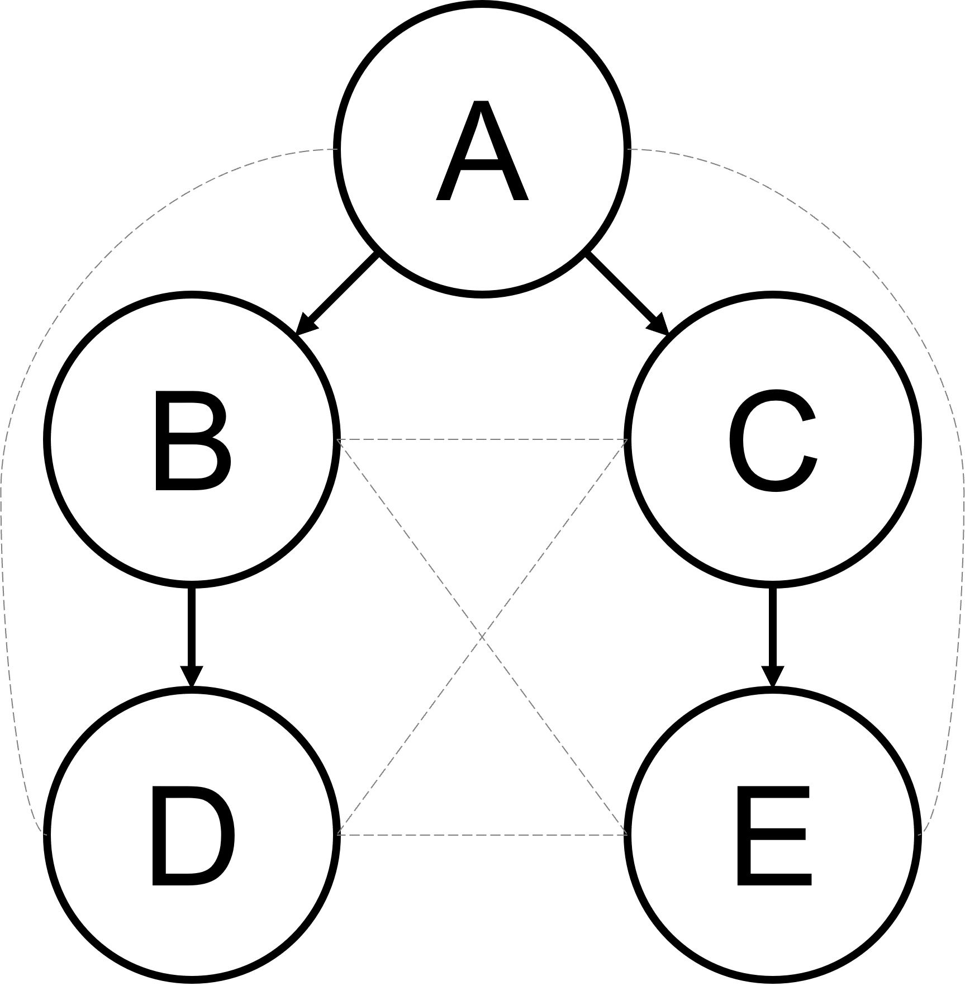
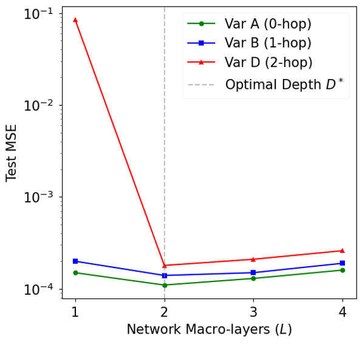
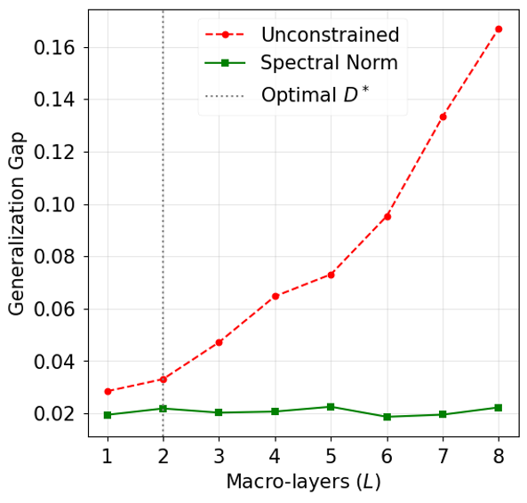
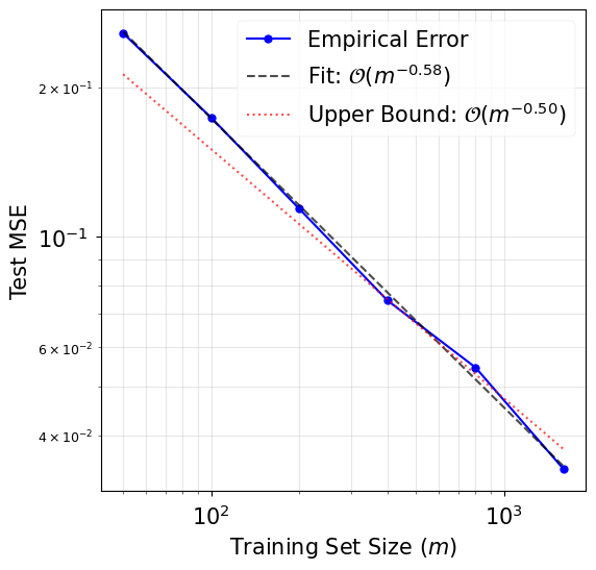
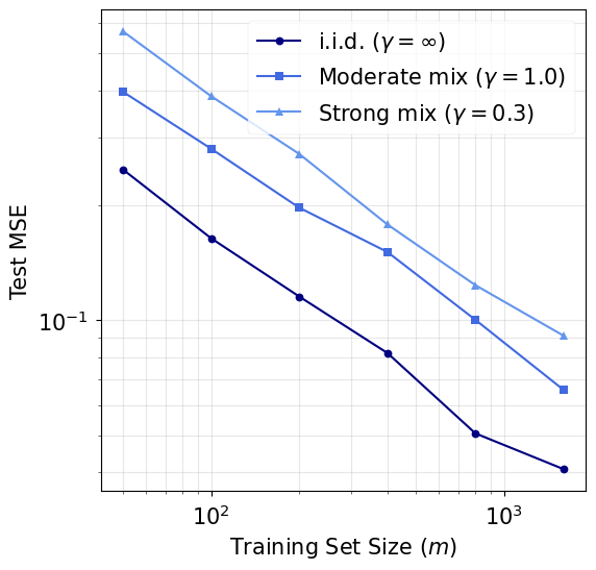
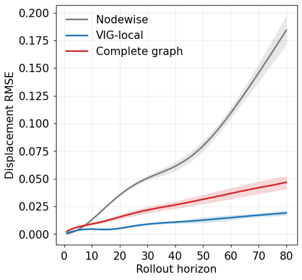

Many physical systems contain several variables that evolve together. Temperature affects pressure. One chemical concentration activates another. Displacement changes velocity, velocity alters stress, and the resulting stress feeds back into motion.

Most machine-learning models are told only that all of these variables exist. They are not told **which variables can directly influence which others**.

Our work on **Variable-Interaction Graph Networks (VIGNets)** asks a different question:

> **If the governing equations already tell us which physical variables interact, why should a neural operator be forced to learn every possible interaction from scratch?**

The central idea is to construct a directed graph _directly_ from the coupling structure of the governing equations. Each node is a physical variable. A directed edge means that the evolution equation for one variable genuinely depends on another. A neural operator then passes information only along those physically admissible edges.

This sounds like a simple architectural choice. The work goes much further. We prove when that graph is sufficient for universal approximation, when the network must be at least a certain depth, why unnecessarily deep networks can generalise worse, how graph sparsity influences statistical complexity, what happens when the graph is wrong, and how the results change when the training observations are temporally dependent rather than independent.

The experiments then test those claims on three coupled PDE systems.

::: {.callout-note}
## The idea in one sentence
A VIGNet does not ask a neural network to discover every possible physical dependency. It hard-codes the dependencies that the equations already establish, and learns only the unknown functional relationships along those permitted routes.
:::

## The problem: coupled equations contain structure

Consider a system of $N$ evolving physical variables

$$
\partial_t u_i
=
F_i\!\left(
 u_1,\ldots,u_N,
 \nabla u_1,\ldots,\nabla^k u_N;
 x,t
\right),
\qquad i=1,\ldots,N.
$$

Here $u_i$ is the $i$th physical field and $F_i$ is its evolution law. The solution operator

$$
\mathcal H:\mathcal X_{\mathrm{obs}}\to\mathcal Y_{\mathrm{target}}
$$

maps an observed initial state to the future solution of the coupled system.

A conventional neural operator can learn this map directly. Fourier Neural Operators and DeepONets, for example, are powerful methods for learning maps between function spaces [@vig_li2021; @vig_lu2021]. But a generic operator does not automatically know that some cross-variable dependencies are impossible.

Suppose the equation for $u_4$ depends on $u_2$, and the equation for $u_2$ depends on $u_1$. Then $u_1$ can affect $u_4$ through the chain

$$
u_1\longrightarrow u_2\longrightarrow u_4.
$$

If $u_3$ never enters either equation, a fully connected model still allocates parameters to interactions involving $u_3$. VIGNet instead builds the admissible interaction pattern into the architecture before learning begins.

This is a **structural prior**: a restriction on what the network is allowed to represent, derived from the governing physics.

## Defining the Variable-Interaction Graph

The graph is not defined informally. It is derived from the functional derivative of the PDE evolution operator.

Let

$$
\mathcal G^*=(V,E^*)
$$

be the Variable-Interaction Graph. There is one node for each state variable, so $|V|=N$.

A directed edge

$$
j\to i
$$

exists if and only if there is some admissible state $u$ for which

$$
\frac{\delta F_i}{\delta u_j}(u)\not\equiv 0.
$$

Equivalently,

$$
(j\to i)\notin E^*
\quad\Longleftrightarrow\quad
\frac{\delta F_i}{\delta u_j}(u)\equiv0
\text{ for all admissible }u.
$$

In ordinary language, an edge $j\to i$ means:

> changing variable $u_j$ can change the instantaneous evolution law for variable $u_i$.

This is stronger than correlation. It comes from the governing operator itself.

The graph contains self-interactions and cross-variable interactions:

$$
E^*=E_{\mathrm{self}}\cup E_{\mathrm{cross}}.
$$

The important sparsity regime is

$$
|E_{\mathrm{cross}}|\ll N(N-1),
$$

meaning that the real physics couples only a small fraction of all possible variable pairs.

{#fig-vig fig-alt="Variable-Interaction Graph for the morphogen benchmark, with variables A, B, C, D and E connected according to the PDE coupling structure." width=62%}

### A crucial scope condition: explicit-evolution systems

The theory requires the system to have **explicit evolution form**. Each evolution equation must be a local differential operator and the system must not contain a global algebraic or elliptic constraint that instantly couples all variables.

This matters because the graph is intended to describe how information propagates through the equations during time evolution.

A canonical counterexample is incompressible Navier--Stokes. The pressure field is obtained from a global Poisson solve, so information is coupled nonlocally at each instant. In that case a simple local variable-interaction graph does not faithfully represent the full dependency mechanism.

Therefore the current theory covers explicit-evolution PDE systems, including reaction--diffusion and related coupled systems, but **does not claim to cover every PDE system**.

## Why graph paths correspond to real physical dependence

The first key result is a **Path-Dependence Lemma**.

If there is no directed path from variable $u_j$ to variable $u_i$ in $\mathcal G^*$, then the future solution component $\mathcal H_i$ is functionally independent of the initial condition $u_j^0$:

$$
\frac{\delta\mathcal H_i}{\delta u_j^0}(u^0)\equiv0.
$$

This is important because it justifies the graph restriction mathematically. Removing a non-edge from the neural architecture is not merely a heuristic form of pruning: under the explicit-evolution assumptions, an absent graph path corresponds to an absent functional dependency in the true solution operator.

::: {.callout-tip}
## Plain-language interpretation
If the equations provide no route by which one variable can influence another, the neural operator does not need an artificial route either.
:::

## The effective graph diameter tells us how deep the network must be

Not every dependency is direct. Some variables influence one another only through intermediate variables.

For observed variables $V_{\mathrm{obs}}$ and prediction targets $V_{\mathrm{target}}$, define the **effective VIG diameter**

$$
D^*
=
\max_{v\in V_{\mathrm{target}},\,
      u\in V_{\mathrm{obs}}\cap\mathrm{Anc}(v)}
\mathrm{dist}_{\mathcal G^*}(u,v).
$$

Here $\mathrm{dist}_{\mathcal G^*}(u,v)$ is the length of the shortest directed path from $u$ to $v$, and $\mathrm{Anc}(v)$ is the set of variables that can influence $v$ through some directed path.

So $D^*$ is the longest physically relevant dependency chain that information must traverse.

If a target depends on an input through two intermediate interactions, a one-layer message-passing network cannot communicate that information far enough. This becomes a theorem rather than a rule of thumb.

## The VIGNet architecture

A VIGNet stores a function-valued representation at every variable node. At macro-layer $l$, node $i$ holds

$$
h_i^{(l)}\in L^2(\Omega\times[0,T]).
$$

The next representation is

$$
h_i^{(l+1)}(x,t)
=
\sigma\!\left(
W_i^{(l)}h_i^{(l)}(x,t)
+
\sum_{j\in\mathcal N^-(i)}
\Phi_{ji}^{(l)}[h_j^{(l)}](x,t)
\right).
$$

There are two distinct operations here.

The first is a **self-update**,

$$
W_i^{(l)}h_i^{(l)},
$$

which lets a variable transform its own representation.

The second is a sum of **cross-variable messages**,

$$
\sum_{j\in\mathcal N^-(i)}\Phi_{ji}^{(l)}[h_j^{(l)}],
$$

but only from variables $j$ for which the VIG contains the edge $j\to i$.

The per-edge operator $\Phi_{ji}^{(l)}$ is itself a nonlinear neural operator. Its basic integral component is a causal Volterra operator

$$
\mathcal K_{ji}^{(l)}[f](x,t)
=
\int_0^t\!\int_\Omega
\kappa_{ji}^{(l)}(x,y,t,\tau;\theta)
\,f(y,\tau)\,dy\,d\tau.
$$

The integral is causal because it only integrates over $\tau\le t$. The kernel $\kappa_{ji}^{(l)}$ learns how information from variable $j$, location $y$ and earlier time $\tau$ contributes to variable $i$ at location $x$ and time $t$.

The architecture therefore separates two questions:

1. **Which variables are allowed to communicate?** The VIG answers this from the equations.
2. **What functional transformation travels along an allowed edge?** The neural operator learns this from data.

```{mermaid}
flowchart LR
    A[Coupled PDE system] --> B[Compute variable dependencies]
    B --> C[Variable-Interaction Graph]
    C --> D[One function-valued node per variable]
    D --> E[Messages only along admissible edges]
    E --> F[Volterra neural operator on each edge]
    F --> G[Repeat for L macro-layers]
    G --> H[Predicted future fields]
```

## Theorem 1: the graph restriction does not destroy expressive power

A natural concern is that constraining the network to a sparse graph may make it too weak.

The universal-approximation theorem shows that, under the stated regularity assumptions, this need not happen.

If the observed input set is compact in $L^2$, the solution operator is continuous, $s>d/2$, and the network has at least $D^*$ macro-layers, then for every $\varepsilon>0$ there exists a VIGNet $M^*$ satisfying

$$
\sup_{u\in\mathcal X_{\mathrm{obs}}}
\left\|
M^*(u)-\mathcal H(u)
\right\|_{(L^2)^{|V_{\mathrm{target}}|}}
<\varepsilon.
$$

The graph can therefore be sparse **without sacrificing universal approximation**, provided the architecture is deep enough for information to traverse every physically relevant path.

The proof uses operator universal approximation results [@vig_chen1995; @vig_kovachki2023] and constructs the required edgewise function-space mappings while respecting the VIG topology.

## Theorem 2: too little depth creates an irreducible error

The depth condition is not merely sufficient.

If

$$
L<D^*,
$$

and there is no global pooling, no global node mixing, and no skip connection that bypasses the VIG, then

$$
\inf_{M\in\mathcal A_{\mathcal G^*}^{(L)}}
\sup_{u\in\mathcal X_{\mathrm{obs}}}
\|M(u)-\mathcal H(u)\|>0.
$$

In other words, some error cannot be removed by more training, more width or better optimisation. Information simply cannot travel far enough through the graph.

{#fig-depth fig-alt="Test MSE versus VIGNet macro-layers for variables at zero, one and two graph hops. The two-hop variable has very high error at one layer and sharply improves at two layers." width=67%}

The 2-D morphogen experiment makes this result visible. Variable $D$ depends on $A$ through

$$
A\to B\to D.
$$

At $L=1$, the model cannot transmit the influence of $A$ to $D$. The manuscript reports a test MSE of approximately

$$
8.5\times10^{-2}
$$

for variable $D$. At $L=2=D^*$, the error drops to approximately

$$
1.8\times10^{-4}.
$$

That is not simply an optimisation improvement: it is the architectural threshold predicted by the graph.

## Theorem 3: too much depth can also be harmful

If too few layers are bad, it may seem natural to keep adding more. The theory shows why that can also be undesirable.

Suppose every macro-layer has Lipschitz constant at least

$$
\Lambda_l\ge\Lambda_{\min}>1.
$$

Then the global Lipschitz factor grows at least as

$$
\Lambda_{\mathrm{global}}
\ge
(\Lambda_{\min})^L.
$$

That exponential amplification enters the covering-number and generalisation bounds. One form of the resulting high-probability gap is

$$
\left|R(\widehat M)-\widehat R_S(\widehat M)\right|
\lesssim
\frac{
[L(|E^*|+|V|)]^{\frac{s}{2s+d_\kappa}}
(\Lambda_{\min})^{\frac{Ld_\kappa}{2s+d_\kappa}}
}{
m^{\frac{s}{2s+d_\kappa}}
}
+
C_2\sqrt{\frac{\log(1/\delta)}{m}}.
$$

The exact constants depend on the hypothesis class and data dependence, but the qualitative message is clear: when layers are expansive, unnecessary depth can make the learned operator less statistically stable.

Spectral normalisation changes this behaviour. When the per-layer Lipschitz factor is controlled at approximately one, the exponential depth factor becomes polynomial.

{#fig-depth-gen fig-alt="Generalisation gap versus number of macro-layers. The unconstrained network rises sharply with depth, while the spectrally normalised network remains nearly flat." width=67%}

This leads to a more precise architectural principle than simply "deeper is better":

> **Use enough graph layers to span the longest physical dependency path, and control extra depth if additional computation is required.**

## Hard structural physics and soft equation physics are different

VIGNet can also be trained with an optional physics-informed residual loss:

$$
\mathcal L_{\mathrm{total}}(\theta)
=
\mathcal L_{\mathrm{data}}(\theta)
+
\lambda_1
\sum_{i=1}^N
\left\|
\partial_t M_{\theta,i}
-
F_i(M_{\theta,1},\ldots,M_{\theta,N})
\right\|_{L^2}^2
+
\lambda_2\mathcal L_{\mathrm{BC/IC}}(\theta).
$$

It is important to separate this from the VIG itself.

The **VIG is a hard structural prior**: it removes inadmissible variable-to-variable pathways from the architecture.

The **PDE residual is a soft analytical prior**: it penalises predictions that fail to satisfy the governing equations.

The manuscript treats the hard graph structure as the main mechanism. The PDE residual is optional. In the data-rich experiments, cross-validation drives $\lambda_1$ close to $10^{-6}$, effectively switching the residual off. It becomes useful in the data-scarce regime.

For example, in the FitzHugh--Nagumo ablation, the reported mean test MSE changes as follows:

| Training samples $m$ | Data loss only | Cross-validated PI loss | Relative gain |
|---:|---:|---:|---:|
| 50 | $3.81\times10^{-2}$ | $1.94\times10^{-2}$ | 49% |
| 100 | $1.47\times10^{-2}$ | $9.62\times10^{-3}$ | 35% |
| 200 | $6.83\times10^{-3}$ | $5.71\times10^{-3}$ | 16% |
| 800 | $1.22\times10^{-3}$ | $1.18\times10^{-3}$ | 3% |
| 1,600 | $4.91\times10^{-4}$ | $4.85\times10^{-4}$ | 1% |

So the physics residual is most useful when observations are scarce; the graph prior remains useful because it changes the hypothesis class itself.

## Why a sparse physical graph can generalise better

A fully connected $N$-variable graph contains $N(N-1)$ possible cross-variable edges. A VIG uses only the cross-couplings present in the governing system.

For Sobolev-bounded edge kernels, the manuscript obtains the covering-number bound

$$
\log\mathcal N
\left(
\varepsilon,
\mathcal H^*_{\mathrm{VIG}},
L^2
\right)
\le
C\left[
|E^*|
\left(\frac{B_\kappa}{\varepsilon}\right)^{d_\kappa/s}
+
|V|
\left(\frac{B_W}{\varepsilon}\right)^{(d+1)/s}
\right],
$$

with

$$
d_\kappa=2d+2.
$$

The important term is $|E^*|$. Statistical complexity grows with the number of physically admitted interactions, rather than automatically with every possible pair of variables.

This is the formal version of a simple intuition:

> a network should need fewer examples to learn a problem when it is not forced to consider interactions the equations already rule out.

## Generalisation when training data are correlated

Scientific data are often not independent. Consecutive states from a simulation trajectory can be strongly correlated.

The theory therefore does not rely only on an i.i.d. assumption. It considers stationary exponentially $\beta$-mixing data,

$$
\beta(k)\le\beta_0e^{-\gamma k}.
$$

This means dependence decays as observations become farther apart in time.

Using a Bernstein inequality for weakly dependent sequences [@vig_merlevede2011], the manuscript derives the high-probability upper bound

$$
R(\widehat M)
\le
\inf_{h\in\mathcal H^*_{\mathrm{VIG}}}R(h)
+
C_1
(|E^*|+|V|)^{\frac{2s}{2s+d_{\mathrm{eff}}}}
 m^{-\frac{2s}{2s+d_{\mathrm{eff}}}}
+
C_2\sqrt{\frac{\log(1/\delta)}{m}}.
$$

For the function-space Volterra parameterisation analysed in the paper,

$$
d_{\mathrm{eff}}\le2d+2.
$$

The constants depend on the smoothness bounds and on the strength of temporal dependence, but the rate exponent in $m$ is retained.

{#fig-sample fig-alt="Log-log plot of test MSE versus training set size, with empirical slope approximately minus 0.58 and a theoretical reference rate." width=67%}

{#fig-mixing fig-alt="Test MSE versus training set size for independent, moderately dependent and strongly dependent data. The curves have similar slopes but different vertical levels." width=67%}

The experiments vary the regularity of the input distribution. For Matérn input regularity $\alpha\in\{2,3,4\}$, the reported fitted exponents are

$$
\widehat r_{\alpha=2,3,4}
=
\{0.50,0.58,0.66\},
$$

with bootstrap 95% intervals

$$
[0.46,0.54],\quad[0.54,0.62],\quad[0.62,0.71].
$$

The leading-order theoretical exponents are approximately

$$
\{0.50,0.60,0.67\}.
$$

The manuscript is careful not to overstate this agreement: the nonlinear FitzHugh--Nagumo regularity argument contains a bounded parabolic smoothing correction, so the experiment is strong evidence for the rate prediction rather than a definitive identification of every regularity constant.

## Lower bounds: how fast can any method possibly learn?

An upper bound says VIGNet can achieve a certain statistical rate. A lower bound asks whether any estimator could fundamentally do better.

For the simpler problem of learning one output component, the manuscript proves

$$
\inf_{\widehat f}
\sup_{f\in\mathcal F}
\mathbb E\left[
\|\widehat f-f\|_{L^2}^2
\right]
\ge
c\,m^{-\frac{2s}{2s+d}}.
$$

That bound captures the cost of recovering an output function but not the full kernel-identification problem of learning an operator.

Under an additional **input-richness** condition, the operator-level lower bound becomes

$$
\inf_{\widehat{\mathcal H}}
\sup_{\mathcal H\in\mathcal H^*_{\mathrm{VIG}}}
R(\widehat{\mathcal H})
\ge
c'
|E^*_{\mathrm{cross}}|^{\frac{2s}{2s+d_{\mathrm{eff}}}}
 m^{-\frac{2s}{2s+d_{\mathrm{eff}}}},
$$

where

$$
d_{\mathrm{eff}}=2d+2.
$$

Combined with the upper bound, this shows that the **sample-size exponent**

$$
\frac{2s}{2s+d_{\mathrm{eff}}}
$$

is minimax-optimal for the analysed function-space hypothesis class under the stated input-richness assumptions.

The manuscript also explicitly notes what remains open: the edge-count prefactor is not matched exactly between the upper and lower bounds.

## What if the Variable-Interaction Graph is wrong?

A practical method cannot assume that the graph will always be perfectly specified.

Let the graph used by the model be

$$
\widehat{\mathcal G}=(V,\widehat E).
$$

Split the graph errors into

$$
E_{\mathrm{miss}}=E^*\setminus\widehat E
$$

and

$$
E_{\mathrm{spur}}=\widehat E\setminus E^*.
$$

The analysis reveals an important asymmetry.

### Missing a true edge is dangerous

If a missing edge breaks every path by which an observed variable can influence a target, then even an arbitrarily deep VIGNet on the incorrect graph has a non-zero approximation floor:

$$
\inf_{M\in\mathcal A_{\widehat{\mathcal G}}^{(\infty)}}
\sup_{u\in\mathcal X_{\mathrm{obs}}}
\|M(u)-\mathcal H(u)\|_{L^2}
\ge
\frac14\eta\varepsilon_0.
$$

Adding more layers cannot repair a physical dependency that the graph forbids.

### Adding an unnecessary edge is less serious

If

$$
\widehat E\supseteq E^*,
$$

so all true interactions remain present, then the correct VIGNet class is contained within the larger class. Spurious-edge kernels can simply be set to zero.

The cost is statistical rather than representational. The generalisation prefactor inflates by at most

$$
\left(
1+\frac{|E_{\mathrm{spur}}|}{|E^*|}
\right)^{\frac{2s}{2s+d_{\mathrm{eff}}}}.
$$

This produces a practical **conservative-superset principle**:

> If a physical interaction is uncertain, it is safer to include the plausible edge than to remove a true interaction.

The empirical probe supports the same distinction. On the morphogen benchmark, removing one true edge $A\to B$ gives test MSE

$$
5.2\times10^{-2},
$$

roughly $290\times$ worse than the correctly specified VIGNet. Adding two spurious edges gives approximately

$$
1.4\times10^{-4},
$$

only about $1.16\times$ worse than the correct graph.

This is one of the most practically useful parts of the theory because it tells us how to behave when the governing interaction structure is only partially known.

## Experiment 1: a coupled elastic system

The first benchmark has three variables: displacement $u$, velocity $v$ and auxiliary stress $w$:

$$
\partial_t u=v,
$$

$$
\partial_t v
=
D_v\partial_{xx}v-k_1u+k_2w,
$$

$$
\partial_t w
=
D_w\partial_{xx}w+k_3v-k_4w.
$$

The effective graph diameter is

$$
D^*=2.
$$

Three graph choices are compared:

- **Nodewise:** no cross-variable edges;
- **VIG-local:** only the true physical edges;
- **Complete graph:** every possible cross-variable edge.

The one-step RMSE results reported in the manuscript are:

| Model | Parameters | One-step RMSE | Rollout RMSE at $T=80$ |
|---|---:|---:|---:|
| Nodewise | 512 | $1.15\pm0.13\times10^{-2}$ | 0.19 |
| VIG-local | 1,268 | $\mathbf{1.59\pm0.18\times10^{-3}}$ | $\mathbf{0.02}$ |
| Complete graph | 24,704 | $4.60\pm0.51\times10^{-3}$ | 0.05 |

The VIG-local model therefore uses far fewer parameters than the complete graph while producing better long-horizon behaviour.

{#fig-rollout fig-alt="Displacement rollout RMSE versus prediction horizon for nodewise, VIG-local and complete-graph models. VIG-local remains lowest over the rollout." width=67%}

The result illustrates both sides of the structural prior. The nodewise model is too sparse and blocks necessary interactions. The complete graph is expressive but statistically and computationally wasteful. The physical graph occupies the useful middle ground.

## Experiment 2: a two-dimensional morphogen pathway

The second benchmark contains five variables:

$$
\partial_t A=D_A\nabla^2A+S(x,y),
$$

$$
\partial_t B=D_B\nabla^2B+k_{AB}A-\gamma_BB,
$$

$$
\partial_t C=D_C\nabla^2C+k_{AC}A-\gamma_CC,
$$

$$
\partial_t D=k_{BD}B-\gamma_DD,
$$

$$
\partial_t E=k_{CE}C-\gamma_EE.
$$

The graph contains the two-hop dependencies

$$
A\to B\to D,
\qquad
A\to C\to E,
$$

so

$$
D^*=2.
$$

This experiment is especially useful because the graph has a transparent biological interpretation: a source morphogen drives intermediate variables, which then regulate downstream variables.

The parameter-matched comparison uses models around a 5.2K-parameter ceiling. The manuscript reports that VIGNet achieves approximately **32-fold** and **71-fold** lower MSE than the parameter-matched Small-FNO and Small-DeepONet baselines. Full-capacity FNO and DeepONet use roughly 1.2M and 2.7M parameters respectively and still trail the VIGNet result in the reported benchmark.

For variable $D$, the graph-depth result is particularly sharp:

$$
L=1:\quad 8.5\pm0.9\times10^{-2},
$$

$$
L=2:\quad 1.8\pm0.2\times10^{-4}.
$$

This is the empirical counterpart of the depth lower bound.

## Experiment 3: FitzHugh--Nagumo

The third benchmark uses the coupled FitzHugh--Nagumo system

$$
\partial_t u
=
D_u\partial_{xx}u
+u(u-a)(1-u)-v,
$$

$$
\partial_t v
=
\epsilon(u-\gamma v).
$$

Because each variable directly influences the other, the VIG is complete for $N=2$ and

$$
D^*=1.
$$

This makes it a useful stress test for the **depth-generalisation theorem** rather than graph sparsity.

Without spectral normalisation, the observed generalisation gap grows approximately as

$$
1.3^L.
$$

With spectral normalisation, it remains below approximately

$$
0.025.
$$

The same experiment also tests the statistical-rate theory with correlated training data and different input smoothness levels.

## Computational scaling

For naive Volterra integration on a discretised spatial grid of size $|\Omega_h|$ with $T_h$ temporal nodes, the cost per macro-layer is

$$
\mathcal O\!\left(
(|E_{\mathrm{self}}|+|E_{\mathrm{cross}}|)
|\Omega_h|^2T_h^2
\right).
$$

With a rank-$r$ kernel parameterisation, the manuscript gives

$$
\mathcal O\!\left(
(|E^*|+|V|)
 r|\Omega_h|T_h
\right).
$$

Again, the edge count matters directly. A sparse VIG reduces both statistical complexity and computational work.

On the 2-D morphogen benchmark, the reported single-A100 training times are approximately:

| Model | Parameters | Time per epoch |
|---|---:|---:|
| VIGNet | about 5.2K | 2.4 min |
| FNO | about 1.2M | 11.7 min |
| DeepONet | about 2.7M | 19.3 min |

These are benchmark-specific measurements rather than universal runtime guarantees, but they illustrate the computational consequence of not modelling interactions that the PDE system does not contain.

## What the theory does and does not establish

The mathematical results are deliberately conditional on explicit assumptions.

**What is established in the manuscript:**

- the VIG is defined from the Fréchet derivative of the explicit-evolution operator;
- absent directed paths imply absent functional dependence under the stated assumptions;
- $L\ge D^*$ is sufficient for universal approximation;
- $L<D^*$ creates irreducible approximation error for a VIG-respecting architecture;
- expansive excess depth worsens the generalisation bound exponentially unless Lipschitz growth is controlled;
- VIG sparsity reduces the covering-number complexity through $|E^*|$;
- exponentially $\beta$-mixing observations admit the stated learning-rate upper bound;
- under input-richness assumptions, the operator-level lower bound matches the sample-size exponent;
- missing true graph edges and adding spurious edges have fundamentally different consequences.

**What is not established:**

- the current VIG construction is not a complete treatment of constraint-coupled systems such as incompressible Navier--Stokes;
- the graph is not automatically discovered from data in the current theory;
- the Sobolev regularisation proposition does not apply to every hyperbolic system;
- the exact edge-count prefactors of the upper and lower minimax bounds are not fully matched;
- the universal-approximation result is existential and does not yet give a complete practical prescription for kernel width, rank or number of per-edge sub-layers;
- the three experiments are controlled scientific benchmarks, not evidence that one architecture will dominate every neural operator on every PDE.

These boundaries are important. The value of the work is not a claim that graph structure solves every operator-learning problem. It is a precise statement about when **known variable-level coupling structure** can be converted into architectural, statistical and computational advantages.

## Why this matters

Neural operators are increasingly used when directly solving a physical model is expensive. But many scientific systems are neither completely independent nor completely coupled. They have structured interactions.

The VIG gives us a way to represent those interactions at the level that scientists often reason about them: **which physical quantities actually influence which others?**

That creates a bridge between mechanistic modelling and machine learning:

- the equations determine the admissible dependency graph;
- the graph determines where information may travel;
- graph distances determine the minimum useful network depth;
- graph sparsity controls part of the statistical and computational complexity;
- neural operators learn the difficult functional transformations along the allowed interactions;
- optional equation residuals can add further regularisation when data are scarce.

The broader research question is therefore not simply how to build a more accurate network. It is:

> **How much of a scientific model's known structure should be encoded before learning begins, and what can we prove when we do so?**

Variable-Interaction Graphs provide one rigorous answer for coupled explicit-evolution PDE systems.

## References

::: {#refs}
:::
